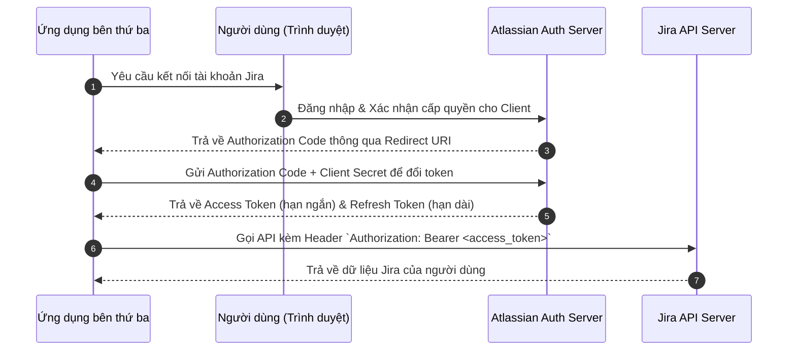
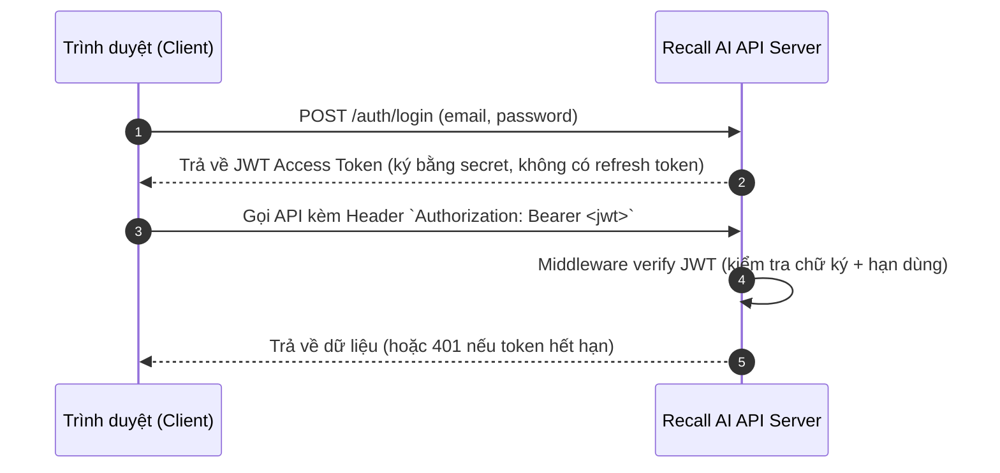

# Phân tích Đối thủ Cạnh tranh (Competitor Analysis): Jira

Tài liệu này thực hiện đánh giá, phân tích đối thủ cạnh tranh **Jira** (Atlassian) dưới góc độ kỹ thuật và tính năng so với dự án **Recall AI**. Mục tiêu nhằm rút ra các bài học thiết kế hệ thống, cấu trúc API, và xác thực cho Recall AI.

---

## 1. Tổng quan về Jira

Jira là công cụ quản lý dự án và theo dõi sự cố (issue tracking) phổ biến nhất thế giới dành cho các đội ngũ phát triển phần mềm theo phương pháp Agile (Scrum/Kanban).

Jira hiện tại được cung cấp dưới 2 mô hình vận hành chính:
*   **Jira Cloud:** Chạy trên hạ tầng đám mây do Atlassian quản lý. Sử dụng kiến trúc Microservices phân tán trên AWS, tối ưu cho việc mở rộng tự động và cập nhật tính năng liên tục.
*   **Jira Data Center:** Phiên bản tự vận hành (self-managed) trên hạ tầng của doanh nghiệp. Sử dụng kiến trúc Cluster Monolith (Active-Active) để đảm bảo tính sẵn sàng cao và khả năng chịu tải lớn.

---

## 2. Bảng so sánh 14 tiêu chí kỹ thuật và tính năng

Bảng dưới đây so sánh chi tiết các khía cạnh tính năng nghiệp vụ, kiến trúc backend, thiết kế API, và xác thực giữa **Recall AI** và **Jira**:

| STT | Tiêu chí so sánh                         | Recall AI (Dự án)                                                                                                                      | Jira (Đối thủ cạnh tranh)                                                                                                                                          |
| :----| :-----------------------------------------| :---------------------------------------------------------------------------------------------------------------------------------------| :-------------------------------------------------------------------------------------------------------------------------------------------------------------------|
| 1   | **Cơ chế lập lịch (Scheduling)**         | **Tự động bằng AI:** Phân tích tài liệu và tự động lên lịch học/ôn tập dựa trên độ khó khái niệm và thời hạn của người dùng.           | **Thủ công bởi con người:** Thành viên dự án tự lên lịch Sprint, đặt thời hạn (due dates) và gán công việc thủ công.                                               |
| 2   | **Trực quan hóa (Visualization)**        | **Đồ thị khái niệm (DAG):** Hiển thị sơ đồ dạng node-link (React Flow) thể hiện mối quan hệ tiên quyết và tô màu theo mức độ hiểu bài. | **Bảng Kanban & Gantt:** Hiển thị công việc dạng cột trạng thái (Kanban Board) hoặc dòng thời gian phụ thuộc (Gantt Chart/Timeline).                               |
| 3   | **Xác thực kiến thức (Verification)**    | **AI Examiner:** Vấn đáp tương tác nhiều lượt có giới hạn để kiểm tra mức độ hiểu sâu của sinh viên dựa trên tài liệu gốc.             | **Không hỗ trợ:** Chỉ quản lý tiến độ hoàn thành task của con người, không có chức năng kiểm tra kiến thức.                                                        |
| 4   | **Truy ngược lỗ hổng (Remediation)**     | **Concept Graph Engine:** Tự động dùng thuật toán BFS ngược để chèn thêm các phiên ôn tập kiến thức nền khi phát hiện điểm yếu.        | **Không hỗ trợ:** Người dùng phải tự nhận diện sự phụ thuộc giữa các task bị nghẽn (blocked/depended task) một cách thủ công.                                      |
| 5   | **Tải lên & Xử lý tài liệu (Ingestion)** | **Xử lý đa phương thức (Multimodal):** AI tự đọc ảnh chụp/văn bản để bóc tách khái niệm và sinh sơ đồ học tập.                         | **Đính kèm tài liệu tĩnh:** Cho phép đính kèm tệp vào issue nhưng không tự phân tích nội dung tệp để tạo cấu trúc công việc.                                       |
| 6   | **Trải nghiệm di động (Mobile App)**     | **Chưa hỗ trợ:** Phiên bản MVP chỉ tập trung tối ưu hóa giao diện Desktop Web cho sinh viên ôn tập.                                    | **Hỗ trợ mạnh mẽ:** Có ứng dụng native chất lượng cao trên cả iOS và Android phục vụ quản lý dự án mọi lúc.                                                        |
| 7   | **Kiến trúc Backend**                    | **Stateless Monolith:** Xây dựng bằng Node.js + Express.js, tất cả logic nằm chung trong một ứng dụng gọn nhẹ.                         | **Microservices (Jira Cloud):** Hệ thống phân tán phức tạp trên AWS. **Cluster Monolith (Data Center):** Java chạy trên Apache Tomcat.                             |
| 8   | **Cơ sở dữ liệu (Database)**             | **PostgreSQL + Prisma ORM:** Lưu trữ quan hệ thực thể, biểu diễn đồ thị thông qua hai bảng `concepts` và `concept_edges`.              | **Hỗ trợ đa RDBMS lớn:** PostgreSQL, Oracle, SQL Server, MySQL kết hợp với lớp ORM tự phát triển (ActiveObjects).                                                  |
| 9   | **Cấu trúc API (API Design)**            | **REST API (Stateless):** Trả về JSON, các endpoint được cấu trúc theo danh từ số nhiều (kebab-case).                                  | **REST API v3 (Stateful/Stateless):** Cực kỳ đồ sộ, sử dụng định dạng JSON, hỗ trợ ngôn ngữ truy vấn JQL và phân trang dựa trên token.                             |
| 10  | **Xác thực API (API Auth)**              | **JWT Bearer Token:** Access token stateless đính kèm vào Header `Authorization`; chưa triển khai cơ chế refresh token riêng biệt.     | **Đa dạng:** OAuth 2.0 (access token ngắn hạn + refresh token dài hạn cho app bên thứ ba), API Token (cho script/tool), và Cookie-based Session (cho trình duyệt). |
| 11  | **Bảo mật & Rate limiting**              | **In-memory Rate Limiting:** Sử dụng `express-rate-limit` lưu trữ trong RAM của server, phù hợp quy mô nhỏ.                            | **Tenant Rate Limiting:** Hệ thống giới hạn cuộc gọi API phức tạp theo từng tài khoản doanh nghiệp và WAF bảo vệ nâng cao.                                         |
| 12  | **Quản lý trạng thái Task**              | **Trạng thái học tập đơn giản:** Trạng thái lưu theo điểm số vững/yếu (`mastery_score`) và ngày kiểm tra gần nhất.                     | **Jira Workflow Engine:** Cho phép thiết lập máy trạng thái vô hạn với các điều kiện chuyển đổi (Transition, Validator, Post-function).                            |
| 13  | **Khả năng cộng tác (Collaboration)**    | **Cá nhân hóa:** Mỗi tài khoản học tập độc lập, tập trung vào tiến trình tự ôn tập của từng cá nhân.                                   | **Cộng tác thời gian thực:** Hỗ trợ phân quyền dự án, bình luận, tag tên `@mention`, phân công công việc và gửi thông báo.                                         |
| 14  | **Báo cáo và thống kê**                  | **Đồ thị hiểu biết:** Thống kê thời gian học (Pomodoro) và biểu diễn bản đồ điểm yếu kiến thức theo môn học.                           | **Báo cáo Agile:** Tự động vẽ biểu đồ tốc độ hoàn thành (Velocity Chart), biểu đồ tích lũy (Cumulative Flow), và Burn-down Chart.                                  |

---

## 3. Phân tích Chi tiết Kiến trúc & API của Jira

### 3.1. Mô hình kiến trúc backend của Jira Cloud
Jira Cloud vận hành trên hạ tầng đám mây của AWS dưới mô hình **Multi-tenancy** (nhiều khách hàng dùng chung tài nguyên hệ thống nhưng được cô lập logic).

Kiến trúc backend được chia nhỏ thành các Microservices chuyên biệt:
*   **Tenant Routing Service:** Định tuyến các request của người dùng về đúng tenant database và logical shard tương ứng.
*   **Issue Service:** Xử lý các tác vụ CRUD (Create, Read, Update, Delete) cho các issue (task).
*   **Workflow Engine:** Máy trạng thái xử lý logic chuyển đổi trạng thái của các task dựa trên cấu hình workflow tùy chỉnh.
*   **Search Service:** Sử dụng Apache Lucene/Elasticsearch làm lõi để xử lý các truy vấn tìm kiếm văn bản và JQL hiệu năng cao.

### 3.2. Cấu trúc REST API v3
REST API v3 của Jira Cloud tuân thủ nghiêm ngặt các nguyên tắc của REST và sử dụng định dạng JSON cho toàn bộ dữ liệu truyền nhận.

#### Ngôn ngữ truy vấn JQL (Jira Query Language)
Jira cho phép người dùng thực hiện các truy vấn tìm kiếm issue cực kỳ mạnh mẽ bằng cách gửi tham số JQL qua Request Body hoặc URL (đã encode).
*   *Ví dụ endpoint tìm kiếm:* `POST /rest/api/3/search/jql` với body `{"jql": "project = RECALL AND status = \"In Progress\""}`

#### Cơ chế phân trang (Pagination) — *đã cập nhật*
Endpoint tìm kiếm cũ (`GET /rest/api/3/search`, dùng `startAt`/`maxResults` theo kiểu offset-based) **đã bị Atlassian deprecate**. Endpoint mới `/rest/api/3/search/jql` chuyển sang cơ chế **phân trang bằng token**:
*   `nextPageToken`: token do server sinh ra, dùng để lấy trang kết quả tiếp theo (thay thế hoàn toàn cho `startAt`).
*   `maxResults`: số lượng bản ghi tối đa trả về trong một trang (mặc định thường là 50).
*   Trường `total` (tổng số bản ghi) **không còn xuất hiện mặc định** trong response mới; muốn biết số lượng gần đúng phải gọi thêm endpoint đếm riêng (`approximate-count`), hoặc lặp qua toàn bộ trang bằng `nextPageToken` để đếm thủ công — kém hiệu quả hơn offset-based trước đây.
*   *Dữ liệu trả về mẫu:*
    ```json
    {
      "isLast": false,
      "nextPageToken": "eyJhbGciOi...",
      "issues": [...]
    }
    ```
*   **Lưu ý kỹ thuật:** cơ chế token khiến các request không thể gọi song song để phân trang (phải đợi response trước để lấy token cho request sau), đánh đổi hiệu năng lấy sự ổn định/an toàn cho hệ thống dưới tải lớn — đây là điểm Recall AI nên cân nhắc khi thiết kế phân trang cho các API có khối lượng dữ liệu lớn (ví dụ danh sách phiên ôn tập, lịch sử kiểm tra).

#### Ví dụ đặc tả Request lấy thông tin của một Task (Issue)
*   **Endpoint:** `GET /rest/api/3/issue/{issueIdOrKey}`
*   **Response mẫu:**
    ```json
    {
      "id": "10001",
      "key": "RECALL-42",
      "self": "https://your-domain.atlassian.net/rest/api/3/issue/10001",
      "fields": {
        "summary": "Nghiên cứu cơ chế tích hợp Gemini API",
        "status": {
          "name": "In Progress",
          "id": "3"
        },
        "assignee": {
          "accountId": "5b10ac8d82e05b22cc7d4ef5",
          "displayName": "Nguyen The Quan"
        },
        "updated": "2026-07-05T09:00:00.000+0700"
      }
    }
    ```

---

## 4. Luồng Xác thực của Jira (Authentication Flows)

Jira hỗ trợ các cơ chế xác thực riêng biệt phù hợp với từng đối tượng sử dụng:

### 4.1. OAuth 2.0 (3-Legged OAuth) — Dành cho ứng dụng bên thứ ba
Luồng xác thực này đảm bảo ứng dụng bên thứ ba không bao giờ biết được mật khẩu của người dùng:



### 4.2. API Token (Basic Auth) — Dành cho Script/Tool tự động hóa
Đối với các script CI/CD hoặc các tool automation chạy ở local, nhà phát triển có thể tạo một API Token cá nhân từ trang Atlassian Account.

*   **Cơ chế truyền nhận:** Gửi qua header `Authorization` bằng cách mã hóa Base64 chuỗi định dạng `email:api_token`.
*   *Cách thức mã hóa:*
    ```typescript
    const credentials = Buffer.from("developer@example.com:api_token_gia_tri").toString("base64");
    const authorizationHeader = `Basic ${credentials}`;
    ```

### 4.3. Cookie-based Session — Dành cho Giao diện Trình duyệt
Khi người dùng truy cập trực tiếp trang web Jira trên trình duyệt, Atlassian sử dụng cơ chế xác thực session stateful truyền thống qua Session Cookie. Sau khi đăng nhập thành công, trình duyệt sẽ tự động đính kèm cookie xác thực (ví dụ: `cloud.session.token`) vào mọi yêu cầu tải trang hoặc gọi API nội bộ.

### 4.4. Luồng xác thực hiện tại của Recall AI (so sánh)



So với OAuth 2.0 của Jira, luồng của Recall AI đơn giản hơn nhiều nhưng có một đánh đổi rõ: khi access token hết hạn, người dùng phải đăng nhập lại hoàn toàn vì **chưa có refresh token**. Đây là điểm nên bổ sung trong giai đoạn tiếp theo (xem mục 5).

---

## 5. Kết luận và Khuyến nghị cho Recall AI

### 5.1. Điểm khác biệt cốt lõi (Positioning)
Jira được thiết kế để **con người quản lý con người** (quản lý dự án, phân công, theo dõi tiến độ), trong khi Recall AI được thiết kế để **AI quản lý việc học của một cá nhân** (lập lịch, kiểm tra, truy vết lỗ hổng kiến thức tự động). Đây không phải là hai sản phẩm cạnh tranh trực tiếp, mà Jira đóng vai trò là "đối thủ tham chiếu" để rút ra bài học về kỹ thuật vận hành ở quy mô lớn.

### 5.2. Bài học nên áp dụng ngay (ngắn hạn)
| Hạng mục | Bài học từ Jira | Đề xuất cho Recall AI |
| :--- | :--- | :--- |
| **Xác thực (Auth)** | OAuth có access token ngắn hạn + refresh token dài hạn | Bổ sung **refresh token** (lưu trong httpOnly cookie hoặc DB) để tránh bắt người dùng đăng nhập lại liên tục. |
| **Phân trang (Pagination)** | Token-based pagination giúp ổn định hơn ở dữ liệu lớn nhưng đánh đổi khả năng gọi song song. | Với API danh sách phiên ôn tập / lịch sử kiểm tra, có thể giữ **offset-based** vì dữ liệu theo từng người dùng, quy mô nhỏ hơn nhiều so với multi-tenant SaaS. |
| **Xử lý lỗi (Error handling)** | Jira trả về mã lỗi HTTP chuẩn kèm `errorMessages` rõ ràng. | Recall AI nên chuẩn hóa format lỗi JSON thống nhất (code, message, field) cho toàn bộ API. |
| **Rate limiting** | Tenant-based rate limiting + WAF | Ở quy mô hiện tại, `express-rate-limit` là đủ; chỉ cần nâng cấp lên Redis-backed rate limiting khi scale ra nhiều instance (tránh tình trạng mỗi server có bộ đếm riêng). |

### 5.3. Định hướng khi mở rộng quy mô (dài hạn)
Khi Recall AI vượt ra khỏi giai đoạn MVP, kiến trúc "Stateless Monolith" hiện tại nên được tách dần theo hướng tương tự mô hình Jira, nhưng ở mức độ vừa phải:
1.  **Tách Concept Graph Engine** thành một service riêng (vì đây là phần tính toán nặng — BFS ngược, phân tích đồ thị) để có thể scale độc lập với phần API CRUD thông thường.
2.  **Tách AI Examiner** (vấn đáp nhiều lượt) thành service riêng do đặc thù cần giữ trạng thái hội thoại (stateful) trong thời gian ngắn, khác với phần còn lại của hệ thống vốn stateless.
3.  Chưa cần đến mô hình multi-tenant phức tạp như Jira Cloud vì Recall AI phục vụ người dùng cá nhân, không có khái niệm "tổ chức" dùng chung tài nguyên như Jira.

### 5.4. Tính năng KHÔNG nên học theo Jira
*   **Workflow Engine tùy biến vô hạn:** phù hợp với quản lý dự án doanh nghiệp nhưng không cần thiết cho một ứng dụng học tập cá nhân — sẽ làm tăng độ phức tạp không cần thiết.
*   **Cộng tác thời gian thực (@mention, phân quyền dự án):** nằm ngoài phạm vi sản phẩm hiện tại (Recall AI tập trung vào trải nghiệm cá nhân hóa), chỉ nên cân nhắc nếu sau này mở rộng sang tính năng học nhóm.


---

*Ghi chú: Các thông tin kỹ thuật về Jira trong tài liệu này được tổng hợp và đối chiếu với tài liệu công khai của Atlassian Developer (developer.atlassian.com) tính đến 07/2026.*

