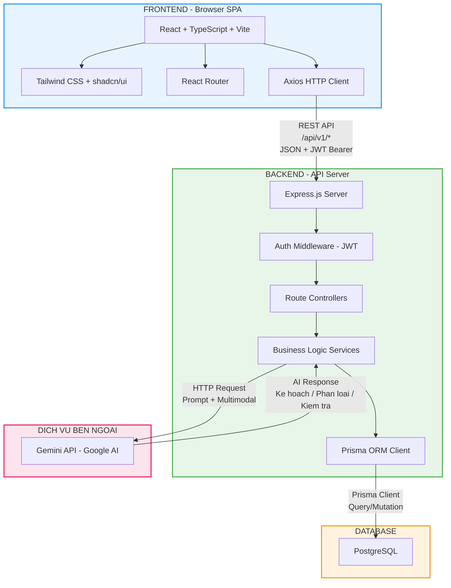
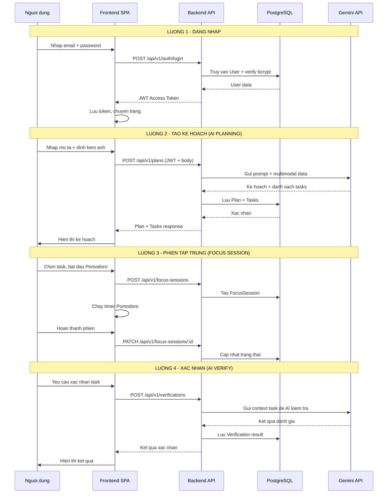
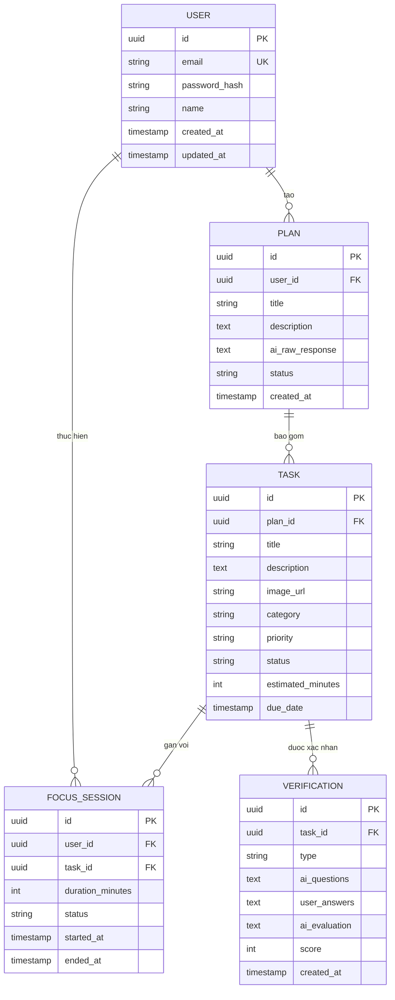
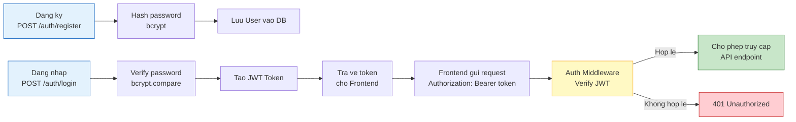

# Kiến trúc Tổng quan Hệ thống - Planning AI

> **Phiên bản:** v0.1 (Sơ khởi)
> **Ngày tạo:** 2026-06-27
> **Tác giả:** System Architect
> **Trạng thái:** Bản nháp - Sẽ được tinh chỉnh (refined) trong Sprint 2-3

---

## 1. Tổng quan

Planning AI là một ứng dụng web kiến trúc **Client-Server (SPA + REST API)**, hỗ trợ người dùng chuyển đổi từ ý định sang hành động thông qua quy trình **Plan - Focus - Verify**, tận dụng AI để cá nhân hóa trải nghiệm.

**Quy mô MVP:** 12 màn hình cốt lõi | **Đối tượng:** Sinh viên, Nhân viên văn phòng | **Nền tảng:** Desktop Web (Chrome/Edge/Firefox)

---

## 2. Sơ đồ Kiến trúc Tổng quan

---

## 3. Sơ đồ Luồng Dữ liệu Chính

---

## 4. Mô tả Chi tiết Từng Thành Phần

### 4.1. Frontend - Browser SPA

| Thành phần   | Công nghệ                | Vai trò                                               |
| ------------ | ------------------------ | ----------------------------------------------------- |
| UI Framework | React 18+ (Vite)         | Render giao diện, quản lý state component             |
| Ngôn ngữ     | TypeScript               | Type-safe, giảm bug runtime, cải thiện DX             |
| Styling      | Tailwind CSS + shadcn/ui | Utility-first CSS, component library accessible + đẹp |
| Routing      | React Router v6+         | Điều hướng SPA, protected routes                      |
| HTTP Client  | Axios                    | Gọi REST API, interceptor JWT, xử lý lỗi tập trung    |

**Trách nhiệm chính:**

- Render 12 màn hình MVP
- Quản lý state phía client (auth token, form data, UI state)
- Gọi API backend qua Axios với JWT token đính kèm
- Xử lý timer Pomodoro phía client (không phụ thuộc server cho countdown)

### 4.2. Backend - API Server

| Thành phần      | Công nghệ    | Vai trò                                                   |
| --------------- | ------------ | --------------------------------------------------------- |
| Runtime         | Node.js      | Môi trường chạy JavaScript phía server                    |
| Framework       | Express.js   | Xử lý HTTP request, routing, middleware                   |
| Auth Middleware | JWT + bcrypt | Xác thực token, mã hóa mật khẩu                           |
| ORM             | Prisma       | Truy vấn database type-safe, migration, schema management |

**Trách nhiệm chính:**

- Cung cấp REST API endpoints (`/api/v1/*`)
- Xác thực và phân quyền (JWT middleware)
- Xử lý business logic (tạo kế hoạch, quản lý phiên, xác nhận)
- Gọi Gemini API và xử lý response AI
- Validate input, xử lý lỗi, trả response chuẩn hóa

### 4.3. Database - PostgreSQL

| Thành phần | Công nghệ  | Vai trò                                         |
| ---------- | ---------- | ----------------------------------------------- |
| RDBMS      | PostgreSQL | Lưu trữ dữ liệu quan hệ, ACID compliance        |
| ORM        | Prisma ORM | Schema-first, type-safe queries, auto migration |

**Các entity chính (sơ khởi):**

### 4.4. Dịch vụ Bên ngoài - Gemini API

| Thành phần | Công nghệ         | Vai trò                                     |
| ---------- | ----------------- | ------------------------------------------- |
| AI Service | Google Gemini API | Xử lý ngôn ngữ tự nhiên, phân tích hình ảnh |

**Các use case AI:**

| Use Case               | Input                       | Output                                  |
| ---------------------- | --------------------------- | --------------------------------------- |
| AI Planning            | Text mô tả + ảnh (tùy chọn) | Kế hoạch + danh sách tasks có phân loại + hình ảnh minh họa subtask |
| AI Task Classification | Context task                | Phân loại: học thuật / sinh hoạt        |
| AI Examiner            | Nội dung task học thuật     | Câu hỏi kiểm tra + đánh giá câu trả lời (text/voice) |

> **Ghi chú:** Tính năng AI Reflection (đối với task sinh hoạt) đã được loại bỏ theo kết quả phỏng vấn người dùng. Thay thế bằng **Màn hình Chúc mừng (Celebration Screen)** với tính năng chụp ảnh khoảnh khắc khi hoàn thành task (xử lý hoàn toàn ở Frontend, không cần AI).

### 4.5. Authentication - JWT Flow

---

## 5. Nguyên tắc Kiến trúc

| Nguyên tắc               | Mô tả                                                                |
| ------------------------ | -------------------------------------------------------------------- |
| YAGNI                    | Chỉ thiết kế cho MVP hiện tại, không dự đoán tương lai               |
| Separation of Concerns   | Frontend xử lý UI, Backend xử lý logic, Database lưu trữ             |
| Stateless Authentication | JWT cho phép scale horizontal nếu cần, không lưu session phía server |
| API-first                | Backend cung cấp REST API chuẩn, Frontend là consumer duy nhất       |
| Type Safety              | TypeScript (FE) + Prisma (BE) đảm bảo type-safe xuyên suốt           |

---

## 6. Quyết định Kiến trúc

| Quyết định                 | Lý do                                              | Phương án đã loại bỏ                            |
| -------------------------- | -------------------------------------------------- | ----------------------------------------------- |
| Monolith (SPA + REST API)  | Team nhỏ, 10 tuần, đơn giản để phát triển + deploy | Microservices, Serverless                       |
| REST thay vì GraphQL       | Team quen thuộc, đủ cho MVP 12 màn hình            | GraphQL, gRPC                                   |
| PostgreSQL thay vì MongoDB | Dữ liệu quan hệ rõ ràng (User-Plan-Task)           | MongoDB, SQLite                                 |
| JWT thay vì Session-based  | Stateless, phù hợp SPA, dễ implement               | Session + Cookie, OAuth2 (quá phức tạp cho MVP) |
| Gemini API thay vì OpenAI  | Free tier, hỗ trợ multimodal sẵn                   | OpenAI GPT, Claude API                          |
| Bỏ AI Reflection, thay bằng Celebration Screen | Kết quả phỏng vấn: người dùng thấy phản tư phiền toái, ưu tiên gamification | Giữ AI Reflection như ban đầu |

---

## 7. Ghi chú Phát triển Tiếp theo

> **Lưu ý:** Đây là bản sơ đồ sơ khởi (v0.1). Các điểm sau sẽ được tinh chỉnh trong Sprint 2-3:

- **Sprint 2:** Thiết kế chi tiết Database Schema (Prisma schema), API Endpoints cụ thể, Error handling strategy
- **Sprint 3:** Thiết kế chi tiết AI Prompt Templates, Caching strategy (nếu cần), Security hardening
- **Sprint 4-5:** Bổ sung File Processing Layer (PDF/DOCX parser) cho AI Planning input, cho phép người dùng tải lên tài liệu PDF/DOCX để AI phân tích và tạo kế hoạch. Quyết định deployment infrastructure, CI/CD pipeline

---
