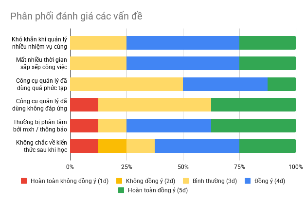
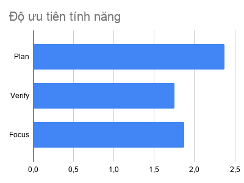
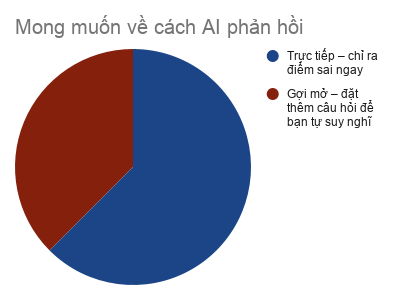

# BÁO CÁO PHÂN TÍCH KHẢO SÁT UX

**Đối tượng:** 100% thuộc nhóm 18-24 tuổi, chủ yếu là Sinh viên (các khối ngành IT, Kinh tế, Ngôn ngữ, Luật).

## 1. CHÂN DUNG NGƯỜI DÙNG (USER PERSONA)

* **Mức độ bận rộn:** Đa số người dùng phải quản lý từ 3 đến hơn 5 nhiệm vụ/deadline mỗi tuần, tương đương 3-10 đầu việc nhỏ mỗi ngày.
* **Thiết bị sử dụng:** Chủ yếu là sự kết hợp giữa Laptop/PC và các thiết bị di động.
* **Môi trường làm việc ưa thích:** Phân cực rõ rệt. Phần lớn thích sự yên tĩnh tuyệt đối (Hoàn toàn một mình), nửa còn lại thích "hiệu ứng đám đông" (có người xung quanh nhưng vẫn làm việc độc lập).

## 2. PHÂN TÍCH CÁC VẤN ĐỀ CỐT LÕI (PAIN POINTS)

Thông qua việc đối chiếu thang đo Likert và các câu hỏi hành vi, 3 "Pain point" lớn nhất của người dùng đã được bộc lộ

### Pain points 1: Rào cản khởi động & Tốn quá nhiều thời gian lên kế hoạch

* **Insight:** Người dùng không sợ làm việc, họ sợ việc "không biết bắt đầu từ đâu". Rất nhiều người tham gia đánh giá "Đồng ý" và "Hoàn toàn đồng ý" cho việc mất nhiều thời gian để sắp xếp và chia nhỏ công việc. Thời gian setup này dao động rất lớn, từ 10 phút đến hơn 1 giờ.

* **Cơ hội:** Đây chính là "điểm chạm" hoàn hảo cho AI. Một công cụ giúp tự động hóa việc chia nhỏ task sẽ giải quyết triệt để rào cản này.

### Pain points 2: Sự phân tâm và Quản lý sự tập trung kém

* **Insight:** Phần lớn người dùng thú nhận họ thường xuyên bị phân tâm bởi mạng xã hội/thông báo, với thời gian mất tập trung phổ biến là từ 15-30 phút, thậm chí hơn 30 phút cho mỗi lần.

* **Cơ hội:** Các công cụ chặn thông báo hoặc đồng hồ Pomodoro tích hợp trực tiếp vào từng task cụ thể là vô cùng cần thiết.

### Pain points 3: Thiếu tự tin về kết quả

* **Insight:** Một lượng lớn người dùng chọn "Đồng ý" và "Hoàn toàn đồng ý" với phát biểu: "Sau khi học xong, tôi không chắc liệu mình đã thực sự hiểu bài hay chưa".
* **Cơ hội:** Tính năng "Verify" (Kiểm tra lại kiến thức) là một điểm khác biệt lớn so với các app To-do list thông thường trên thị trường.

## 3. THÓI QUEN SỬ DỤNG CÔNG CỤ HIỆN TẠI

* **Công cụ sử dụng:** Phần lớn đang dùng các công cụ như Notion, Google Calendar, Todoist, Obsidian, Giấy ghi chú.  

* **Mức độ hài lòng:** Dù đang dùng các tool nổi tiếng, người dùng vẫn đánh giá "Bình thường" về mức độ đáp ứng nhu cầu. Một số phàn nàn rằng các tool hiện tại "thiếu tính năng" hoặc "quá phức tạp để duy trì lâu dài". Điều này cho thấy người dùng đang khao khát một ứng dụng Tất-cả-trong-một (All-in-one) nhưng phải có giao diện/luồng thao tác đơn giản.

## 4. KỲ VỌNG VỀ SẢN PHẨM & TÍNH NĂNG (FEATURE PREFERENCES)

### 4.1. Xếp hạng tính năng AI cốt lõi:

* **Chức năng Plan (AI tự động tạo kế hoạch/chia nhỏ task):** Tính năng được đánh giá yêu thích nhất.  

* **Chức năng Focus (Pomodoro gắn với AI):** Đứng thứ hai.

* **Chức năng Verify (AI kiểm tra kiến thức):** Ít được chọn làm Top 1 nhất, nhưng lại giải quyết đúng "Pain point số 3" đã phân tích ở trên. Có thể phát triển ở Phase 2.

### 4.2. Phong cách phản hồi của AI:

* **Direct (Trực tiếp chỉ ra lỗi sai):** Được đánh giá cao nhất. Sinh viên có xu hướng muốn biết ngay kết quả đúng/sai để tiết kiệm thời gian.

* **Coaching (Gợi mở để tự suy nghĩ):** Phần ít sinh viên chọn cách trả lời này.

---
