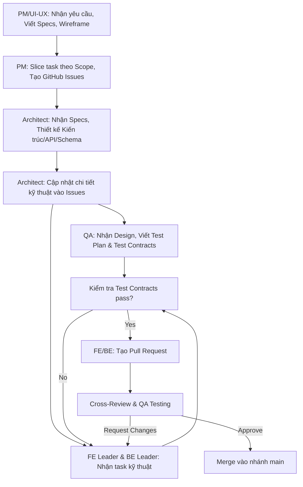

# Quy Trình Làm Việc Nhóm (Team Workflow) - Planning AI

> **Phiên bản:** v1.0
> **Ngày tạo:** 2026-06-29
> **Áp dụng cho:** Toàn bộ thành viên dự án Planning AI
> **Phương pháp luận:** Dựa trên AI-Native SDLC (FSTD)

---

## 1. Tổng quan Quy trình (End-to-End Workflow)

Sơ đồ dưới đây mô tả luồng làm việc cho một tính năng (Feature) từ lúc lên ý tưởng đến khi được merge vào nhánh `main`.

---

## 2. Bảng Vai trò & Trách nhiệm

Bảng phân công theo đề xuất dự án (Dựa trên mô hình RACI).

| Thành viên | Vai trò chính | Trách nhiệm cốt lõi |
| --- | --- | --- |
| **Thái Nguyễn Tuấn Kiệt** | PM + UI/UX | Quản lý tiến độ, soạn Specs, thiết kế wireframe/UI, báo cáo Sprint. Tạo Issues. |
| **Nguyễn Thế Quân** | Architect + Dev | Thiết kế kiến trúc hệ thống, DB schema, API. Trực tiếp code fullstack khi cần. |
| **Nguyễn Minh Phát** | QA + Dev | Viết test plan/cases, kiểm thử tự động/thủ công. Hỗ trợ code backend. |
| **Nguyễn Phương Gia Bảo** | Frontend Leader | Phân bổ task FE, implement UI components, tích hợp API, đảm bảo chất lượng FE. |
| **Ngô Văn Phong** | Backend Leader | Phân bổ task BE, implement REST API, quản lý database, đảm bảo chất lượng BE. |

---

## 3. Quy trình chi tiết: PM + UI/UX (Kiệt)

- **Bước 1 (Requirements):** Thu thập yêu cầu, phản hồi từ người dùng để xác định tính năng cần làm.
- **Bước 2 (Specs & UI):** Viết Specification Document chi tiết cho tính năng. Thiết kế Wireframe/Figma.
- **Bước 3 (Slicing):** Phân rã tính năng thành các task nhỏ (Slice) dựa trên **Scope of Impact** (Giới hạn rủi ro). Không gộp chung FE và BE phức tạp vào cùng 1 cục.
- **Bước 4 (Issue Creation):** Lên GitHub, tạo các **Issues** tương ứng. Đính kèm link Specs và Figma.
- **Handoff (Chuyển giao):** Gắn thẻ (assign) Architect (`@NguyenTheQuan`) vào các Issues vừa tạo để tiến hành thiết kế.

---

## 4. Quy trình chi tiết: Architect + Dev (Quân)

- **Bước 1 (Design):** Nhận GitHub Issues từ PM. Đọc Specs và UI. Phác thảo kiến trúc, API Contracts, và Database Schema.
- **Bước 2 (Refinement):** Cập nhật các quyết định kỹ thuật, endpoint path, cấu trúc bảng trực tiếp vào GitHub Issues để làm tài liệu tham khảo cho Dev.
- **Bước 3 (ADR):** Ghi chú lại lý do ra quyết định vào file `DECISIONS_LOG.md`.
- **Bước 4 (Dev Support):** Trực tiếp code các module khó hoặc hỗ trợ FE/BE Leader khi có blocker.
- **Handoff (Chuyển giao):** Thêm nhãn (label) `design-ready` vào Issues và nhắc (mention) QA và Dev Leaders để bắt đầu thực thi.

---

## 5. Quy trình chi tiết: QA + Dev (Phát)

- **Bước 1 (Test Planning):** Khi Issue đạt trạng thái `design-ready`, QA đọc Specs và Technical Design. Viết các trường hợp kiểm thử (Test Cases).
- **Bước 2 (Test Contracts):** Viết các bài Test tự động (hoặc Test Contracts/Checklist) đảm bảo bao phủ cả luồng thành công và luồng lỗi.
- **Bước 3 (QA Testing):** Sau khi Dev nộp Pull Request (PR), checkout nhánh của PR, chạy thử (manual + automated) dựa trên Test Plan.
- **Bước 4 (Dev Support):** Hỗ trợ Backend Leader trong việc implement các logic phụ hoặc viết Unit Tests.
- **Handoff (Chuyển giao):** Xác nhận `QA Passed` trên PR, hoặc ghi chú lỗi (bug) để Dev sửa lại.

---

## 6. Quy trình chi tiết: Frontend Leader (Bảo)

- **Bước 1 (Implementation):** Nhận task FE từ JIRA/GitHub. Tuân thủ **Coding Conventions** (Platform Leverage Ladder) và Design System (shadcn/ui + Tailwind).
- **Bước 2 (API Integration):** Sử dụng các API Contracts do Architect định nghĩa để tích hợp gọi data từ Backend. (Có thể dùng mock data nếu BE chưa xong).
- **Bước 3 (Self-Review):** Tự kiểm tra lại UI xem có khớp Figma chưa, responsive tốt không, console có báo lỗi không.
- **Handoff (Chuyển giao):** Commit, push lên nhánh tính năng (vd: `feature/login-ui`), tạo PR và tag reviewer.

---

## 7. Quy trình chi tiết: Backend Leader (Phong)

- **Bước 1 (Implementation):** Nhận task BE. Định nghĩa Prisma Models, tạo Migrations. Tuân thủ **Coding Conventions** (Express + Zod).
- **Bước 2 (API Development):** Viết Controller, Service xử lý business logic theo đúng Specs và API Contracts.
- **Bước 3 (Self-Review):** Đảm bảo API trả về đúng HTTP status code và JSON format thống nhất. Chạy thử bằng Postman.
- **Handoff (Chuyển giao):** Commit, push lên nhánh tính năng (vd: `feature/auth-api`), tạo PR và tag reviewer.

---

## 8. Quy trình Review & Merge

Mọi đoạn code phải qua quy trình Pull Request (PR) trước khi được gộp vào nhánh `main`. Không ai được phép push thẳng lên `main`.

1. **Self-Check:** Người tạo PR phải tự kiểm tra code, đảm bảo đã pass linter và tests tại local.
2. **Reviewers (Cross-Review):**
   - FE PR: BE Leader hoặc Architect review logic và convention.
   - BE PR: FE Leader hoặc Architect review API format và logic.
   - QA kiểm tra ứng dụng thực tế.
3. **Tiêu chí "Approve":** Code đáp ứng Specs, tuân thủ Coding Conventions, không vi phạm bảo mật, QA xác nhận passed.
4. **Tiêu chí "Request Changes":** Vi phạm Platform Leverage Ladder, bug logic nghiêm trọng, thiếu test. Người tạo PR phải sửa và yêu cầu review lại.
5. **Merge:** Sau khi có ít nhất 1 Approve (từ Leader/Architect) và QA Passed, người tạo PR tiến hành Squash and Merge.

---

## 9. Công cụ & Quy ước

- **GitHub Issues:** Nơi lưu trữ Task chi tiết. Cấu trúc chuẩn: Mô tả -> Acceptance Criteria -> Technical Notes.
- **GitHub Labels:** `bug`, `enhancement`, `design-ready`, `qa-passed`, `frontend`, `backend`.
- **JIRA Board:** Sử dụng để quản lý tiến độ Sprint tổng quan (To Do, In Progress, Review, Done). Các cột đồng bộ với trạng thái của GitHub Issues.
- **Figma:** Duy nhất UI/UX (Kiệt) cập nhật Master Design. Mọi người chỉ xem và lấy CSS/assets.
- **Discord:**
  - `#general`: Thông báo chung, Sprint meetings.
  - `#dev`: Trao đổi kỹ thuật, hỏi đáp API.
  - `#github-alerts`: Nhận thông báo tự động khi có Issue/PR mới.

---

## 10. Sprint Ceremony (Nghi thức Agile)

- **Sprint Planning:** Cuối mỗi tuần. PM (Kiệt) chủ trì. Team thống nhất mục tiêu Sprint tới và phân bổ lượng story points hợp lý vào JIRA.
- **Daily Standup:** Mỗi ngày qua tin nhắn Discord (buổi sáng). Format 3 câu: Hôm qua làm gì? Hôm nay làm gì? Có gặp blocker nào không?
- **Sprint Review & Retrospective:** Đầu buổi Planning Sprint mới. Demo sản phẩm (working software). Đánh giá những gì làm tốt, những gì cần rút kinh nghiệm cho Sprint sau.
