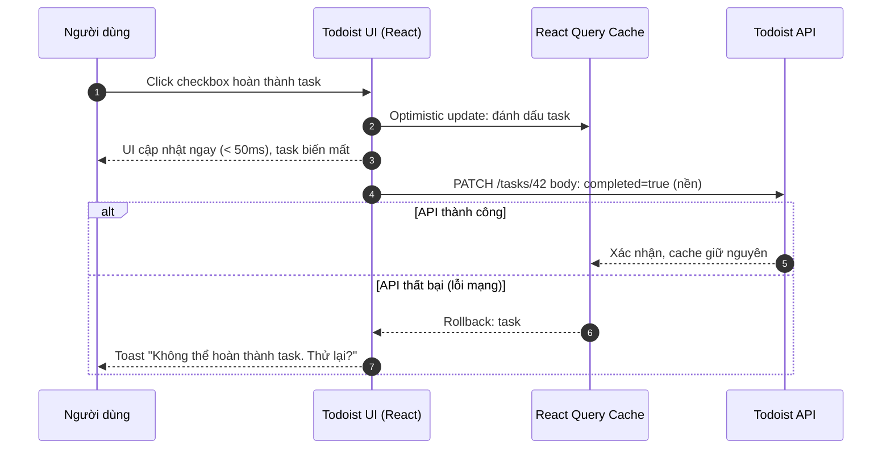
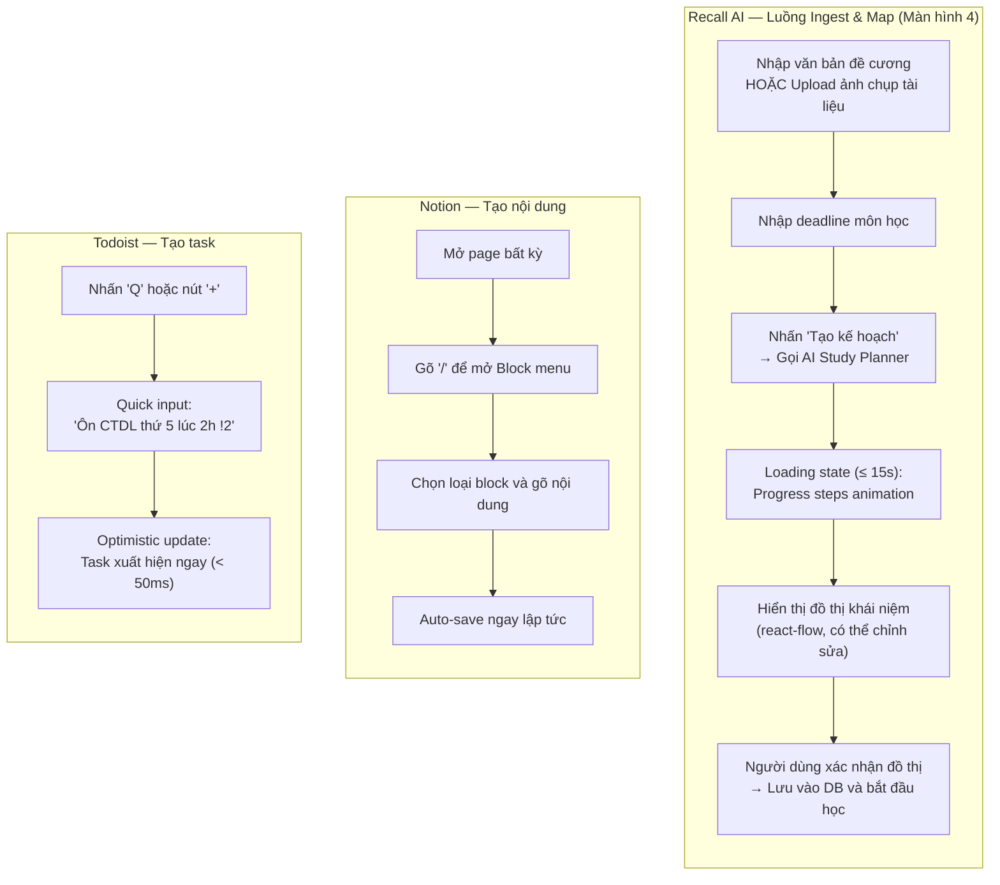
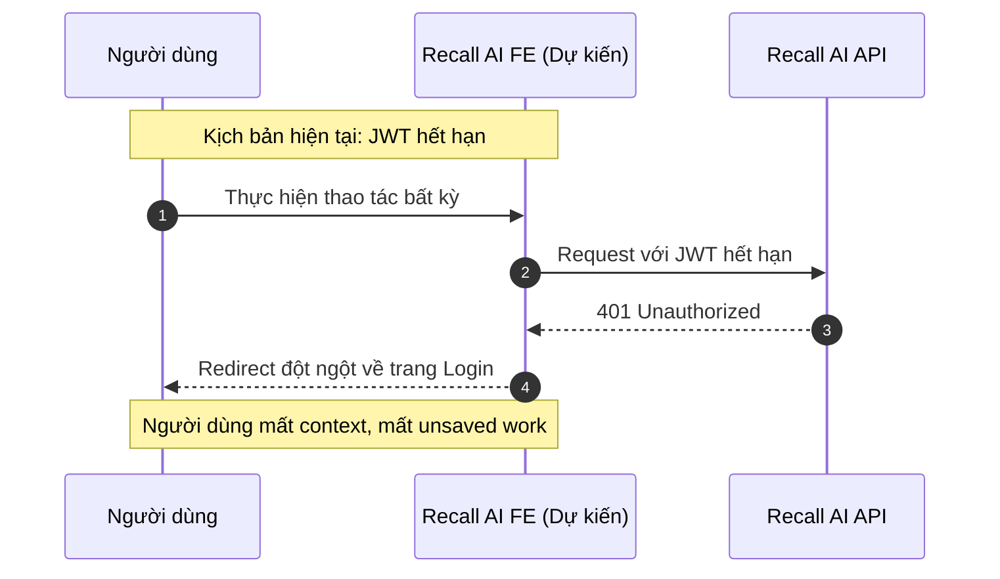
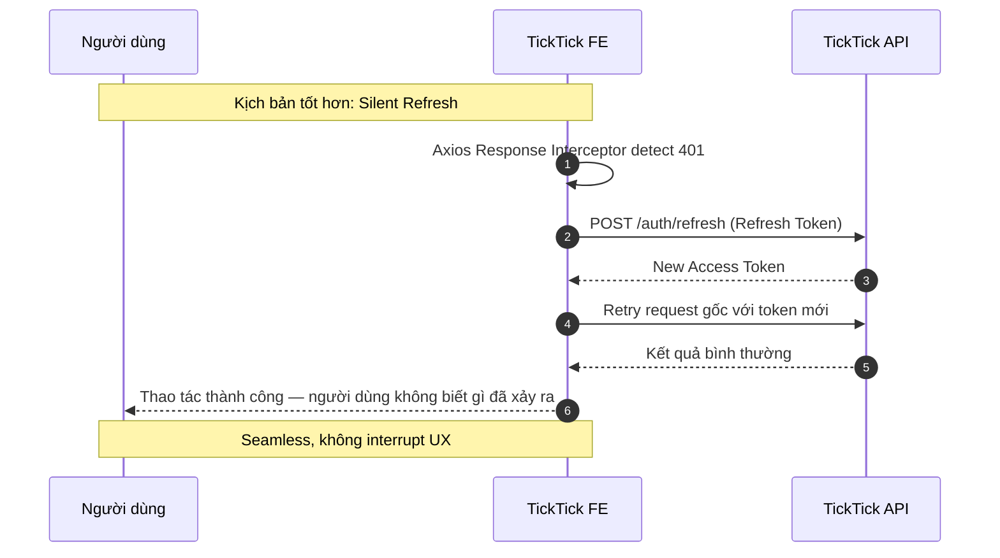

# Competitor Analysis : Notion & Todo List Apps

Tài liệu này thực hiện đánh giá, phân tích hai đối thủ cạnh tranh Notion và các app Todo List hiện có và được dùng phổ biến dưới góc độ **kỹ thuật Frontend**. Mục tiêu nhằm rút ra các bài học về kiến trúc component, UX pattern, state management, và chiến lược data-fetching để áp dụng cho dự án **Recall AI**.

> **Lưu ý:** FE đang ở giai đoạn Elaboration (Sprint 2). Đây là tài liệu phân tích để FE team học hỏi và ra quyết định thiết kế, không phải audit code.

---

## 1. Tổng quan về các đối thủ tham chiếu

### 1.1. Notion
Notion là công cụ năng suất kiểu "all-in-one workspace" là sự kết hợp của ghi chú, quản lý task, cơ sở dữ liệu và cộng tác nhóm trong một sản phẩm duy nhất. Điểm đặc trưng nhất về mặt Frontend là **block-based editor**, đây là mô hình trong đó mọi nội dung (văn bản, ảnh, bảng, to-do, heading) đều được biểu diễn dưới dạng các block độc lập có thể kéo-thả và lồng ghép vào nhau.

Notion FE được xây dựng bằng **React**, sử dụng mô hình **SPA (Single Page Application)**, với state management phức tạp do nhu cầu real-time collaboration và offline editing.

### 1.2. Todoist & TickTick (đại diện Todo List Apps)
Todoist và TickTick là hai ứng dụng Todo List hàng đầu thị trường. Điểm đặc trưng về FE:
*   **Todoist:** Nổi tiếng với UX tối giản, **natural language input** (nhập ngôn ngữ tự nhiên để tự parse deadline, priority), và **optimistic UI** cực kỳ mượt mà, thao tác hoàn thành task có phản hồi tức thì dưới 50ms mà không cần đợi server.
*   **TickTick:** Tập trung vào **Pomodoro Timer tích hợp**, **calendar sync**, và bố cục linh hoạt hơn (List/Kanban/Calendar view trong cùng một ứng dụng).

### 1.3. Recall AI — Bối cảnh hệ thống (từ Project Proposal)
Recall AI là một **SPA (React + Vite + TypeScript + Tailwind CSS + shadcn/ui + Axios + React Router)** không cần SEO, nhắm đến Desktop Web. Sản phẩm có 9 màn hình MVP theo 3 vòng lặp cốt lõi:

*   **Ingest & Map:** Người dùng nhập text hoặc ảnh chụp tài liệu → AI trích xuất khái niệm + quan hệ tiên quyết dưới dạng JSON có schema cố định → Người dùng xem và chỉnh sửa đồ thị trực quan trước khi bắt đầu học.
*   **Schedule → Focus → Verify:** Hệ thống lên lịch ôn tập → Pomodoro Focus Session → AI Examiner vấn đáp nhiều lượt (tối đa N lượt/khái niệm, state machine tất định).
*   **Remediate:** Thuật toán BFS ngược trên Concept Graph (PostgreSQL) tự chèn khái niệm tiên quyết vào lịch khi phát hiện điểm yếu.

---

## 2. Bảng so sánh 14 tiêu chí kỹ thuật Frontend

Bảng dưới đây so sánh chi tiết các khía cạnh UX pattern, component architecture, state management, và chiến lược data-fetching giữa **Recall AI** và các đối thủ tham chiếu:

> **Quy ước đọc bảng:** Cột Recall AI ghi những gì **Project Proposal xác nhận rõ**; những gì chưa quyết định được ghi thẳng là "chưa quyết định". Cột Notion/Todoist ghi **hành vi quan sát được trực tiếp**; chỗ nào là suy luận về internal architecture được ghi chú "Quan sát".

| STT  | Tiêu chí so sánh                   | Recall AI (Thiết kế MVP)                                                                                                                                                                                                                                                                         | Notion (Đối thủ tham chiếu 1)                                                                                                                                     | Todoist / TickTick (Đối thủ tham chiếu 2)                                                                                                                |
| :--- | :--------------------------------- | :----------------------------------------------------------------------------------------------------------------------------------------------------------------------------------------------------------------------------------------------------------------------------------------------- | :---------------------------------------------------------------------------------------------------------------------------------------------------------------- | :------------------------------------------------------------------------------------------------------------------------------------------------------- |
| 1    | **Kiến trúc Component**            | shadcn/ui làm base UI (chốt trong proposal). Tổ chức thư mục theo tính năng là dự kiến của FE leader.                                                                                                                                                                                            | *Quan sát:* Block-based mỗi loại nội dung (text, ảnh, bảng, to-do) là một block độc lập, có thể kéo, thả và lồng ghép. Chi tiết internal architecture không rõ.   | *Quan sát:* TaskItem, ProjectSidebar là các component tái sử dụng được. Internal architecture không rõ.                                                  |
| 2    | **Mô hình nhập liệu (Input UX)**   | **Đa phương thức (text + ảnh):** Người dùng dán văn bản đề cương hoặc upload ảnh chụp tài liệu -> Gemini xử lý multimodal. Đây là điểm khác biệt so với cả Notion lẫn Todoist vì AI đọc nội dung thật, không phải người dùng phải gõ lại.                                                        | **Inline Editing:** Click bất kỳ text nào để edit tại chỗ. Không có form, không có submit mọi thứ auto-save ngay khi thay đổi.                                    | **Natural Language Input:** Gõ "Họp nhóm thứ 6 lúc 3h ưu tiên cao" -> tự parse ra date, time, priority phía client.                                      |
| 3    | **Chiến lược Data-Fetching**       | Axios (chốt trong proposal). Caching strategy và cách quản lý server state là nội dung đang được đánh giá tham khảo và áp dụng                                                                                                                                                                   | *Quan sát:* Điều hướng giữa các trang không reload dữ liệu đã tải, có cơ chế cache phía client. Library cụ thể không rõ.                                          | *Quan sát:* Dữ liệu task persist khi navigate giữa các project. Library cụ thể không rõ.                                                                 |
| 4    | **Optimistic UI**                  | **Không áp dụng cho luồng AI:** Các tác vụ nặng (AI Study Planner, AI Examiner) bắt buộc phải đợi server —> không thể optimistic. Các tác vụ nhẹ (đánh dấu phiên học hoàn thành, cập nhật đồ thị thủ công) chưa được chốt chiến lược.                                                            | *Quan sát:* Mọi thao tác (kéo block, gõ text) phản ánh ngay lên UI không có delay cảm nhận được.                                                                  | *Quan sát:* Tick checkbox → task biến mất ngay (< 50ms) trước khi server phản hồi. Nếu lỗi có toast để undo.                                             |
| 5    | **State Management**               | **Chưa được quyết định trong proposal.** Tình huống phức tạp nhất cần thiết kế riêng: state hội thoại AI Examiner nhiều lượt trong một phiên.                                                                                                                                                    | *Quan sát:* Có undo/redo, multi-tab sync, collaborative editing hình như có global state management phức tạp. Library cụ thể không rõ.                            | *Quan sát:* Filter state, project list persist khi navigate. Library cụ thể không rõ.                                                                    |
| 6    | **Trực quan hóa & View Switching** | **DAG Graph (react-flow):** Hiển thị concept map dạng node-link, tô màu theo `mastery_score` (vững/yếu). Người dùng kéo-thả, xóa, thêm cạnh thủ công. Đây là điểm FE khác biệt hoàn toàn với Notion hay Todoist.                                                                                 | *Quan sát:* 5 loại Database View (Table, Board, Gallery, List, Calendar), người dùng switch view trong cùng 1 dataset, không mất dữ liệu, không có loading delay. | *Quan sát:* List, Board, Calendar view. TickTick thêm Gantt Chart. Switch view không reload dữ liệu.                                                     |
| 7    | **Loading & Skeleton State**       | Theo NFR, AI Examiner và AI Study Planner có thể mất đến 15 giây. Approach cụ thể **chưa được thiết kế** —> đây là khoảng trống UX lớn nhất cần giải quyết trước Sprint 3.                                                                                                                       | *Quan sát:* Skeleton placeholder xuất hiện khi load trang, khớp với layout thật, không có "flash of empty content".                                               | *Quan sát:* Skeleton layout hiện khi load project. Task đã cache hiện ngay, task mới tải sau.                                                            |
| 8    | **Xử lý lỗi & Empty State**        | **Chưa được thiết kế chi tiết:** Project Proposal đề cập cơ chế fallback khi AI lỗi/hết quota (chuyển sang chế độ flashcard tĩnh, người dùng tự chấm). Đây là empty/error state phức tạp cần chốt thiết kế UI cẩn thận trước khi đưa vào implement.                                              | *Quan sát:* Trang trống hiển thị gợi ý hành động (CTA). Có indicator khi mất kết nối.                                                                             | *Quan sát:* "Không có task hôm nay" vs "Chưa có project nào" có nội dung và CTA khác nhau, không dùng chung một màn hình trống.                          |
| 9    | **Responsive & Platform Strategy** | **Desktop Web only (MVP):** Theo Project Proposal, target là Desktop Web, không hỗ trợ mobile trong MVP. Đây là quyết định có chủ đích cho phép tập trung hoàn thiện trải nghiệm Desktop thay vì dàn trải.                                                                                       | *Quan sát:* Có layout riêng cho Desktop (sidebar rộng) và Mobile (bottom navigation, collapsible).                                                                | *Quan sát:* Cả Todoist và TickTick đều có mobile app chất lượng cao, hỗ trợ PWA và notification push.                                                    |
| 10   | **Animation & Micro-interaction**  | Transition giữa các màn hình sẽ được dự kiến đưa vào thêm. Các library trong stack (shadcn/ui, react-flow) đều có animation built-in nên sẽ có animation ở mức tối thiểu từ những component này.                                                                                                 | *Quan sát:* Kéo thả block có ghost preview + drop zone highlight. Hover trên block hiện toolbar. Mở trang có slide-in.                                            | *Quan sát:* Tick task xong có confetti nhỏ (Todoist). Progress bar gamification. Swipe gesture trên mobile.                                              |
| 11   | **AI Waiting State UX**            | **Chưa được thiết kế:** Đây là tiêu chí đặc thù của Recall AI điểm mà chưa có ở Notion hay Todoist. Recall AI có 2 điểm chờ AI dài: (1) AI Study Planner trích xuất đồ thị (≤ 15s), (2) AI Examiner sinh câu hỏi mỗi lượt (≤ 15s). UX trong khoảng chờ này quyết định lớn đến perceived quality. | **Không áp dụng:** Notion không có tác vụ AI blocking nào trong luồng chính.                                                                                      | **Không áp dụng:** Todoist/TickTick không có luồng AI blocking.                                                                                          |
| 12   | **Xác thực & Auth UX Flow**        | **Email + Password (và có thể Google OAuth):** Theo Project Proposal, đăng nhập bằng email + mật khẩu là chắc chắn; Google OAuth được đề cập là tùy chọn (mục 5.6). JWT tự xây. Chưa có quyết định về refresh token UX trên FE.                                                                  | *Quan sát:* Hỗ trợ đăng nhập Google, Apple, SSO SAML. Session persist khi mở nhiều tab. Chi tiết implementation không rõ.                                         | *Quan sát:* Session persist dài hạn khi token hết hạn, người dùng không bị redirect về login đột ngột (ngụ ý có silent refresh). Cơ chế cụ thể không rõ. |
| 13   | **Graph Interaction UX**           | **Tiêu chí đặc thù Recall AI:** Người dùng xem, kéo-thả, thêm/xóa cạnh trên DAG concept graph (react-flow) trước khi bắt đầu học. Đây là màn hình phức tạp nhất về UX của toàn hệ thống hiện theo như quan sát chưa thấy có feature để so sánh đối chiếu.                                        | **Không áp dụng.**                                                                                                                                                | **Không áp dụng.**                                                                                                                                       |
| 14   | **Performance Optimization**       | Theo NFR: FCP ≤ 3s, TTI ≤ 4s. react-flow với ≤ 50 node là giới hạn MVP và chưa cần virtual list. Các kỹ thuật tối ưu cụ thể **chưa được quyết định**, nên xem xét thêm công cụ CI.                                                                                                               | *Quan sát:* Điều hướng nhanh, không có full-page reload. Trang có nhiều nội dung vẫn scroll mượt. Kỹ thuật cụ thể không rõ.                                       | *Quan sát:* Danh sách task rất dài vẫn scroll mượt, có virtual list hoặc pagination. Kỹ thuật cụ thể không rõ.                                           |

---

## 3. Phân tích Chi tiết UX Pattern & Kỹ thuật

### 3.1. Block-based Editor của Notion — Bài học cho màn hình Ingest

Notion giải quyết bài toán "nội dung phong phú" bằng cách trừu tượng hóa mọi đơn vị nội dung thành **Block**:

```
BlockRegistry
├── TextBlock        → <p>, <h1>, <h2>
├── ToDoBlock        → checkbox + text
├── ImageBlock       →  + caption
├── DatabaseBlock    → bảng dữ liệu mini
└── EmbedBlock       → iframe nội dung nhúng
```

Mỗi block là một React component độc lập. Khi kéo thả, chỉ cần hoán vị `blockId` trong mảng thứ tự, không cần re-render toàn bộ trang.

**Bài học rút ra:** Màn hình **Tạo kế hoạch ôn tập** sau khi AI trả về danh sách khái niệm, người dùng có thể chỉnh sửa thứ tự, xóa, thêm khái niệm. Nếu biểu diễn mỗi concept card là một component độc lập (tương tự block), thao tác kéo-thả re-order sẽ gọn hơn nhiều (chỉ cần swap index trong mảng, không rebuild state toàn bộ).

---

### 3.2. Optimistic UI Pattern của Todoist — Áp dụng có chọn lọc

Todoist áp dụng optimistic update cho mọi tác vụ đơn giản:



**Bài học cho Recall AI — áp dụng có chọn lọc:**

| Tác vụ Recall AI                     | Optimistic UI?      | Lý do                                                                          |
| :----------------------------------- | :------------------ | :----------------------------------------------------------------------------- |
| AI Study Planner                     | **Không**           | Tác vụ nặng, server phải xử lý thật mới có kết quả. Cần loading state rõ ràng. |
| AI Examiner (sinh câu hỏi)           | **Không**           | Mỗi câu hỏi phụ thuộc câu trả lời trước — không thể đoán trước.                |
| Đánh dấu Focus Session hoàn thành    | **Xem xét áp dụng** | Tác vụ đơn giản, chỉ ghi log. Rollback dễ nếu lỗi.                             |
| Chỉnh sửa thủ công cạnh trong đồ thị | **Xem xét áp dụng** | Người dùng kéo-thả → cập nhật UI ngay → gọi API lưu nền.                       |
| Đăng xuất / Hủy kế hoạch             | **Không**           | Hành động có hậu quả lớn, nên chờ xác nhận từ server.                          |

---

### 3.3. AI Waiting State UX — Tiêu chí đặc thù của Recall AI

Đây là điểm không Notion hay Todoist nào có, nhưng lại là thách thức UX lớn nhất của Recall AI. Theo NFR, Gemini API có thể mất đến 15 giây. Có 3 cách tiếp cận, từ tệ đến tốt:

```
❌ Tệ nhất:    [Spinner xoay] ... (15 giây trống)

⚠️ Trung bình: [Spinner] "Đang xử lý tài liệu..."

✅ Tốt nhất:   Progress steps animation:
               ① Đang đọc tài liệu...        [████░░░░░░]  40%
               ② Đang phát hiện khái niệm... [███████░░░]  70%
               ③ Đang xây đồ thị tiên quyết  [██████████] 100%
               → Hiển thị kết quả
```

**Gợi ý triển khai:** Không cần BE trả về progress thật — FE có thể fake progress bằng timed animation steps (setTimeout chuyển bước mỗi 4–5 giây). Người dùng nhìn thấy app "đang làm gì đó có ý nghĩa" thay vì màn hình im lìm.

---

### 3.4. View Switching Pattern của Notion — Áp dụng cho Dashboard

Notion tổ chức "cùng 1 dataset, nhiều cách hiển thị" bằng cách tách biệt hoàn toàn **data layer** và **presentation layer**:

```
DatabaseStore (Zustand)
    │
    ├── useTableView()    → <TableView />     (rows × columns)
    ├── useBoardView()    → <BoardView />     (columns × cards)
    └── useCalendarView() → <CalendarView />  (days × events)
```

Khi người dùng switch view, không có API call nào được phát thêm — data đã có trong store, chỉ swap presentation component.

**Bài học rút ra cho screen Dashboard:** Cùng dữ liệu concept graph có thể hiển thị theo 2 mode:
*   **Graph View** (react-flow): Sơ đồ node-link tô màu theo `mastery_score` — đang có trong thiết kế.
*   **List View** (table/list): Danh sách khái niệm + cột trạng thái vững/yếu — hữu ích khi đồ thị phức tạp, khó đọc.

Không cần gọi API mới — data đã có, chỉ render khác.

---

## 4. Luồng Trải nghiệm Người dùng (UX Flow So sánh)

### 4.1. Luồng Tạo kế hoạch — Recall AI vs. Đối thủ



**Phân tích:** Recall AI có luồng phức tạp nhất — nhưng đây là **trade-off có chủ ý**: đầu vào (text hoặc ảnh thô) phức tạp hơn, đầu ra (đồ thị khái niệm có cấu trúc, sẵn sàng để học) có giá trị cao hơn nhiều so với chỉ tạo một task. Điểm cần đầu tư FE là **UX trong 15 giây chờ** (bước loading) và **UX chỉnh sửa đồ thị** (bước xác nhận).

---

### 4.2. Luồng Xác thực (Auth UX) — Recall AI vs. TickTick





**Ghi chú:** Project Proposal đã nhận diện rủi ro này — *"Cần tự triển khai refresh token rotation, token blacklist khi đăng xuất"*. Silent refresh là giải pháp FE cần phối hợp với BE để triển khai.

---

## 5. Kết luận và Khuyến nghị cho Recall AI FE

### 5.1. Điểm khác biệt cốt lõi (Positioning)

Notion được thiết kế để **tổ chức mọi loại nội dung** (flexibility tối đa). Todoist/TickTick được thiết kế để **xử lý task nhanh nhất có thể** (speed & friction tối thiểu). Recall AI được thiết kế để **AI đọc tài liệu và lên lịch + kiểm tra kiến thức** (intelligence-first, theo Project Proposal).

Recall AI không cạnh tranh trực tiếp với cả hai. Notion và Todoist đóng vai trò **đối thủ tham chiếu UX** — học cách làm các phần tương tác của người dùng mượt mà, trong khi điểm khác biệt thật sự nằm ở Concept Graph Engine và AI Examiner.

### 5.2. Bài học nên áp dụng ngay (Ngắn hạn — trước Sprint 3)

| Hạng mục                 | Bài học từ đối thủ                                     | Đề xuất cụ thể cho Recall AI                                                                                                                                                                                          |
| :----------------------- | :----------------------------------------------------- | :-------------------------------------------------------------------------------------------------------------------------------------------------------------------------------------------------------------------- |
| **AI Waiting State**     | Không có đối thủ nào gặp vấn đề này — phải tự thiết kế | Thêm **multi-step progress animation** cho 2 màn hình: (1) AI Study Planner (≤ 15s), (2) AI Examiner mỗi lượt hỏi. Fake progress bằng timed steps nếu BE không trả về progress thật.                                  |
| **Graph Interaction UX** | Không có đối thủ nào có feature tương đương            | Thiết kế rõ ràng 3 mode của màn hình đồ thị: (a) View-only mode (Dashboard), (b) Edit mode (sau khi AI trả kết quả, trước khi xác nhận), (c) Disabled mode (đang trong phiên học).                                    |
| **Loading & Skeleton**   | Skeleton screen — Notion                               | Thêm skeleton component cho Dashboard và màn hình kết quả phiên Interview. Ưu tiên hơn spinner vì người dùng biết layout sắp xuất hiện.                                                                               |
| **Auth UX**              | Silent refresh — TickTick                              | Bổ sung Axios Response Interceptor tự động gọi `/auth/refresh` khi nhận 401, retry request gốc. Phối hợp với BE bổ sung refresh token endpoint (đã được nhận diện trong Project Proposal).                            |
| **Optimistic UI**        | Task completion — Todoist                              | Áp dụng cho: đánh dấu Focus Session hoàn thành, kéo-thả chỉnh sửa cạnh đồ thị. Không áp dụng cho tác vụ AI blocking.                                                                                                  |
| **Empty State**          | Phân tầng theo context — Todoist                       | Thiết kế riêng cho ít nhất 3 trường hợp: "Chưa có kế hoạch nào" (Dashboard trống), "AI trả về đồ thị rỗng" (0 khái niệm trích xuất được), "Không còn khái niệm nào cần ôn hôm nay".                                   |
| **Error Handling**       | Fallback graceful — Project Proposal                   | FE cần thiết kế UI cho cơ chế fallback đã ghi trong proposal: *khi AI lỗi/hết quota, chuyển sang chế độ flashcard tĩnh, người dùng tự chấm đúng/sai*. Đây không phải error thông thường mà là degraded mode có chủ ý. |

### 5.3. Định hướng khi mở rộng quy mô (Dài hạn — sau MVP)

1.  **Bổ sung List View cho Dashboard:** Học pattern của Notion cùng concept graph data hiển thị dưới dạng bảng (tên khái niệm, `mastery_score`, lần kiểm tra gần nhất), rất hữu ích khi đồ thị đủ lớn để khó đọc trực quan.

2.  **TanStack Query cho data fetching:** Khi số màn hình tăng và cần điều hướng qua lại, cache tự động sẽ tránh fetch lại data đã biết. Phù hợp nhất cho Dashboard (data không thay đổi liên tục) và Session History.

3.  **Command Palette (⌘K):** Học từ Notion: điều hướng nhanh giữa các kế hoạch học mà không cần dùng sidebar. Hữu ích khi người dùng có nhiều môn học đồng thời.

4.  **Voice Input cho AI Examiner:** Project Proposal đã ghi nhận đây là feature cân nhắc sau MVP, khi triển khai, Web Speech API (native browser) là lựa chọn trước khi dùng thư viện ngoài (theo nguyên tắc "Nấc Thang Tận Dụng Nền Tảng" trong Coding Conventions).

### 5.4. Tính năng KHÔNG nên học theo đối thủ

*   **Block-based Editor của Notion:** Quá phức tạp để triển khai và không phù hợp người dùng Recall AI không cần tự viết nội dung, AI đọc và trích xuất thay.
*   **Real-time Collaboration của Notion:** Ngoài phạm vi Recall AI là trải nghiệm học tập cá nhân hóa, theo Project Proposal.
*   **Natural Language Parser hoàn chỉnh của Todoist:** Recall AI đã có Gemini xử lý ngôn ngữ tự nhiên ở server-side — xây thêm client side parser là duplicate logic không cần thiết.
*   **Karma & Gamification của Todoist:** Không phù hợp với mục tiêu học tập nghiêm túc, có thể gây phân tâm.

---

*Ghi chú: Các thông tin kỹ thuật về Notion và Todoist/TickTick trong tài liệu này được tổng hợp từ tài liệu công khai, bài viết kỹ thuật, và quan sát trực tiếp hành vi ứng dụng. Thông tin về Recall AI được dựa trực tiếp từ [Project Proposal (PA0)](file:///Users/nguyenphuonggiabao/Documents/Project%20file/planning-ai/pa/pa0/project-proposal.md) tính đến 07/2026.*
