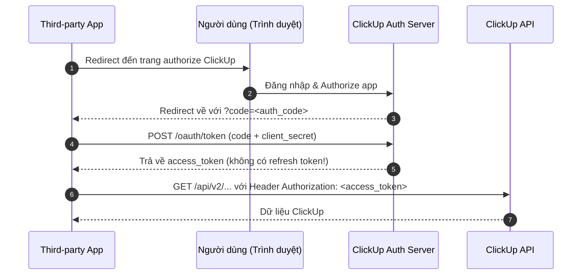

# Phân tích Đối thủ Cạnh tranh (Competitive Audit): ClickUp & Google NotebookLM

Tài liệu này thực hiện **competitive audit** hai đối thủ tham chiếu **ClickUp** và **Google NotebookLM**. Mục tiêu là rút ra các bài học thiết kế hệ thống và UX, tập trung vào ba điểm mấu chốt:

1. **Tính năng tự đánh giá / kiểm tra (Self-assessment & Quiz)**
2. **Học tập hỗ trợ AI (AI-powered Learning)**
3. **Chất lượng trải nghiệm người dùng (UX Quality)**

> **Phân loại đối thủ:**
> - **ClickUp** → *Đối thủ tham chiếu kỹ thuật & kiến trúc* (giống vai trò của Jira): Học về quy mô, API, auth, database.
> - **Google NotebookLM** → *Đối thủ cạnh tranh trực tiếp nhất* (giống vai trò của Notion/Todoist): Cùng phân khúc AI-powered learning, nhắm vào sinh viên/researcher.

---

## 1. Tổng quan về ClickUp

ClickUp là nền tảng quản lý công việc "all-in-one" dành cho cả cá nhân lẫn doanh nghiệp, cạnh tranh trực tiếp với Jira, Asana và Notion. Điểm đặc trưng là hệ thống phân cấp dữ liệu linh hoạt (Workspace → Space → Folder → List → Task) cùng **15+ chế độ hiển thị** và **ClickUp Brain** — lớp AI tích hợp sâu vào toàn bộ workspace.

---

## 2. Tổng quan về NotebookLM

NotebookLM là công cụ nghiên cứu và học tập AI sử dụng kiến trúc **RAG (Retrieval-Augmented Generation)** để đảm bảo mọi câu trả lời của AI đều được neo vào nguồn tài liệu người dùng cung cấp — giúp giảm thiểu hallucination (ảo giác).

Tính năng nổi bật nhất là **Audio Overviews** (podcast AI 2 giọng), **Quiz & Flashcard tự động**, **Mind Map tương tác**, và chế độ **Interactive Mode** cho phép người dùng ngắt và đặt câu hỏi cho AI host trong khi nghe.

---

## 3. Bảng so sánh 14 tiêu chí — Góc nhìn Kỹ thuật & Tính năng nghiệp vụ

> **Quy ước đọc bảng:** Mỗi tiêu chí được so sánh giữa Recall AI (dự án), ClickUp và NotebookLM. Cột Recall AI phản ánh thiết kế MVP hiện tại từ Project Proposal. Cột đối thủ dựa trên tài liệu công khai và quan sát trực tiếp.

| STT | Tiêu chí so sánh | Recall AI (Dự án) | ClickUp (Đối thủ tham chiếu kỹ thuật) | Google NotebookLM (Đối thủ cạnh tranh trực tiếp) |
| :--- | :--- | :--- | :--- | :--- |
| 1 | **Cơ chế lập lịch (Scheduling)** | **Tự động bằng AI:** Phân tích tài liệu và tự động lên lịch học/ôn tập dựa trên độ khó khái niệm và deadline của người dùng. | **Thủ công + semi-automation:** Người dùng tự tạo task, đặt due date. ClickUp Brain có thể gợi ý chia nhỏ task và điền deadline nhưng **không tự động tạo lịch học từ nội dung tài liệu**. | **Không có lịch học tự động:** NotebookLM không tạo lịch ôn tập; người dùng chủ động vào app để học khi muốn. Không có cơ chế nhắc nhở dựa trên độ quên (forgetting curve). |
| 2 | **Trực quan hóa (Visualization)** | **Đồ thị khái niệm (DAG):** Hiển thị sơ đồ node-link (React Flow) tô màu theo `mastery_score`, thể hiện quan hệ tiên quyết giữa các khái niệm. | **15+ loại view:** Board (Kanban), List, Calendar, Gantt/Timeline, Table (Spreadsheet), Workload, Whiteboard, Mind Map, và hơn 10 view khác. Đây là điểm mạnh vượt trội của ClickUp. | **Mind Map tự động + Audio/Video:** NotebookLM sinh Mind Map từ nguồn tài liệu, hỗ trợ zoom vào node để hỏi sâu hơn. Không có DAG quan hệ tiên quyết; chỉ visualize mối liên kết chủ đề, không phân cấp học tập. |
| 3 | **Xác thực kiến thức (Verification / Quiz)** | **AI Examiner:** Vấn đáp tương tác nhiều lượt có giới hạn, kiểm tra mức độ hiểu sâu dựa trên tài liệu gốc của người dùng. | **Không có quiz/kiểm tra kiến thức:** ClickUp không hỗ trợ bất kỳ tính năng kiểm tra học thuật nào. ClickUp Brain chỉ trả lời câu hỏi về workspace/task, không sinh câu hỏi để test người dùng. | **Tính năng core — Quiz & Flashcard tự động:** Sinh multiple-choice quiz từ tài liệu upload, điều chỉnh độ khó (Easy/Medium/Hard) và số lượng câu. Giải thích câu sai kèm trích dẫn nguồn. Đây là điểm cạnh tranh trực tiếp và gần nhất với AI Examiner của Recall AI. |
| 4 | **Truy ngược lỗ hổng (Remediation)** | **Concept Graph Engine:** Tự động dùng thuật toán BFS ngược để chèn thêm phiên ôn tập kiến thức nền khi phát hiện điểm yếu. | **Không hỗ trợ:** ClickUp không có cơ chế tự phát hiện và vá lỗ hổng kiến thức. Người dùng phải tự nhận ra khi làm quiz bên ngoài và tạo task ôn tập thủ công. | **Có một phần — qua Prompt:** Sau khi quiz sai, người dùng có thể click "Explain" để nhận giải thích sâu hơn kèm citation. NotebookLM **không tự động chèn nội dung ôn tập tiên quyết** — cần người dùng chủ động hỏi lại. Chưa có BFS tự động. |
| 5 | **Tải lên & Xử lý tài liệu (Ingestion)** | **Xử lý đa phương thức (Multimodal):** AI tự đọc ảnh chụp/văn bản để bóc tách khái niệm và sinh sơ đồ học tập có cấu trúc. | **Đính kèm tài liệu tĩnh:** Hỗ trợ attach file vào task/doc, tích hợp Google Drive, Confluence. ClickUp Brain có thể **tóm tắt** tài liệu nhưng không trích xuất concept graph. | **Đa nguồn phong phú:** Hỗ trợ PDF, Google Docs, Slides, website URL, YouTube video, file âm thanh. RAG đảm bảo AI chỉ dùng nội dung từ nguồn đã upload — không hallucinate kiến thức bên ngoài. Đây là điểm mạnh hơn Recall AI về độ đa dạng nguồn đầu vào. |
| 6 | **Trải nghiệm di động (Mobile App)** | **Chưa hỗ trợ (MVP):** Tập trung hoàn thiện Desktop Web, không hỗ trợ mobile trong phạm vi MVP. | **Mobile app native chất lượng cao:** iOS và Android đầy đủ tính năng, hỗ trợ offline, push notification, widget màn hình chính. Đây là một trong những điểm mạnh nhất của ClickUp. | **Có mobile app (iOS & Android):** Quản lý notebook, offline access, background playback Audio Overview, share nội dung từ ứng dụng khác qua menu "Share". Bổ sung quiz/flashcard trên mobile. |
| 7 | **Kiến trúc Backend** | **Stateless Monolith:** Node.js + Express.js, toàn bộ logic trong một ứng dụng gọn nhẹ. | **Distributed SaaS:** Kiến trúc phân tán hỗ trợ hàng triệu concurrent users. Không công bố chi tiết stack, nhưng xác nhận dùng PostgreSQL, layer cache, và API gateway. Hệ thống sharded để đảm bảo sub-second latency. | **Google Cloud — RAG Pipeline:** Chạy trên hạ tầng Google Cloud. Core engine là Gemini (multimodal LLM) kết hợp RAG pipeline để grounding câu trả lời vào tài liệu. Enterprise API (2025) hỗ trợ CRUD notebooks programmatically. |
| 8 | **Cơ sở dữ liệu (Database)** | **PostgreSQL + Prisma ORM:** Lưu trữ quan hệ thực thể; đồ thị qua bảng `concepts` và `concept_edges`. | **PostgreSQL (xác nhận):** Dùng cho structured data. Kết hợp caching layer và có thể search engine riêng cho full-text search trong workspace. | **Không công khai:** Google không tiết lộ chi tiết database nội bộ. Suy luận từ kiến trúc RAG: vector database (embedding) + object storage (files) + relational store (metadata notebook). |
| 9 | **Cấu trúc API (API Design)** | **REST API (Stateless):** JSON, endpoint theo danh từ số nhiều kebab-case. | **REST API v2 (Public):** Base URL `https://api.clickup.com/api/v2`. Cấu trúc endpoint phản ánh hierarchy: `/team/{team_id}/space`, `/list/{list_id}/task`. JSON format. Rate limit: 100 req/phút/token. | **Enterprise API (Giới hạn):** Chỉ dành cho enterprise với Gemini Enterprise license. Hỗ trợ CRUD notebook, quản lý source, query notebook. Không có public API cho developer phổ thông (2026). |
| 10 | **Xác thực API (API Auth)** | **JWT Bearer Token:** Stateless access token; chưa có refresh token riêng biệt. | **Personal API Token + OAuth 2.0:** Personal token (`pk_` prefix) không hết hạn — phù hợp script. OAuth 2.0 Authorization Code Grant cho third-party app. Header: `Authorization: <token>` (không cần prefix "Bearer"). | **Google OAuth 2.0:** Dùng Google Account để đăng nhập. Enterprise API dùng Google Cloud service account credentials. Không có personal API token dạng self-service. |
| 11 | **Bảo mật & Rate Limiting** | **In-memory Rate Limiting:** `express-rate-limit` lưu trong RAM, phù hợp quy mô nhỏ. | **Workspace-level Rate Limiting:** 100 req/phút/token. Trả về HTTP 429 + `Retry-After` header. Bảo mật workspace theo role (Owner, Admin, Member, Guest) với granular permission. | **Không có public API → không áp dụng rate limit truyền thống:** Bảo mật thông qua Google Account authentication + Google Cloud IAM cho Enterprise API. Notebook có thể share với link nhưng có quyền view-only. |
| 12 | **Quản lý trạng thái Task / Learning** | **Trạng thái học tập đơn giản:** Lưu theo `mastery_score` (vững/yếu) và ngày kiểm tra gần nhất. | **Custom Status Workflow:** Người dùng tự định nghĩa trạng thái task không giới hạn (To Do, In Progress, Review, Done, v.v.). Automations trigger khi status thay đổi. | **Không có learning state management:** NotebookLM không lưu "trạng thái học" của người dùng theo từng khái niệm. Mỗi lần quiz là session độc lập. Không có mastery score hay progress tracking liên tục theo thời gian. |
| 13 | **Khả năng cộng tác (Collaboration)** | **Cá nhân hóa:** Mỗi tài khoản học tập độc lập, tập trung vào tiến trình tự ôn tập cá nhân. | **Cộng tác thời gian thực đầy đủ:** @mention, comment, assign task, real-time editing Doc, notification, guest access, team workspace, phân quyền granular. Đây là use case chính của ClickUp. | **Chia sẻ có giới hạn:** Có thể share notebook qua link (view-only). Chưa có co-editing hay @mention trong notebook. Hướng đến trải nghiệm cá nhân, phù hợp với mục tiêu của Recall AI. |
| 14 | **Báo cáo và Thống kê** | **Đồ thị hiểu biết:** Thống kê thời gian học (Pomodoro), bản đồ điểm yếu kiến thức theo môn học. | **Báo cáo năng suất đội nhóm:** Dashboard tùy chỉnh, Time Tracking báo cáo, Workload view (ai đang quá tải), Reporting feature cho manager. | **Không có analytics/reporting:** NotebookLM không cung cấp báo cáo học tập, không có thống kê thời gian học, số câu quiz đúng/sai tích lũy theo thời gian. Đây là **khoảng trống lớn nhất** của NotebookLM so với Recall AI. |

---

## 4. Phân tích Chi tiết — ClickUp

### 4.1. ClickUp Brain: AI Knowledge Manager

ClickUp Brain là lớp AI tích hợp sâu vào toàn bộ workspace, hoạt động theo mô hình **"connected AI"** — khác với NotebookLM chỉ làm việc với tài liệu upload, Brain biết về task, doc, comment, và lịch sử của cả workspace.

**Khả năng thực sự của Brain:**
- Trả lời câu hỏi về trạng thái dự án: *"Task nào đang bị block?"*, *"Ai đang xử lý issue #42?"*
- Tóm tắt thread comment dài, tạo meeting notes từ recording
- Đề xuất subtask khi tạo task mới dựa trên context
- Tự động điền field (assignee, due date) bằng AI suggestion
- **Không thể:** Sinh quiz từ tài liệu học, tạo lịch ôn tập, kiểm tra kiến thức người dùng

**Bài học cho Recall AI:**
> ClickUp Brain là minh chứng rõ rằng AI "kết nối dữ liệu nội bộ" (task + doc + comment) tạo ra giá trị khác hoàn toàn với AI "đọc tài liệu học thuật để dạy người dùng". Recall AI không cần lo cạnh tranh với ClickUp Brain vì đây là hai use case khác nhau.

### 4.2. Cấu trúc API ClickUp v2

```
Base URL: https://api.clickup.com/api/v2

Hierarchy:
GET /team                          → Danh sách Workspace
GET /team/{team_id}/space          → Danh sách Space trong Workspace
GET /space/{space_id}/folder       → Danh sách Folder
GET /folder/{folder_id}/list       → Danh sách List
GET /list/{list_id}/task           → Danh sách Task trong List
GET /task/{task_id}                → Chi tiết một Task
POST /list/{list_id}/task          → Tạo Task mới
PUT /task/{task_id}                → Cập nhật Task
```

**Ví dụ response một Task:**
```json
{
  "id": "abc123",
  "name": "Nghiên cứu Gemini API integration",
  "status": {
    "status": "in progress",
    "color": "#4194f6",
    "type": "custom",
    "orderindex": 1
  },
  "creator": {
    "id": 183,
    "username": "nguyen-van-a",
    "email": "abc@example.com"
  },
  "assignees": [],
  "due_date": "1720000000000",
  "priority": { "id": "2", "priority": "high" }
}
```

**Điểm đáng chú ý kỹ thuật:**
- `Authorization` header dùng raw token, **không có prefix "Bearer"** — khác với convention thông thường
- `due_date` là Unix timestamp milliseconds — không phải ISO 8601
- Rate limit chỉ 100 req/phút — rất thấp so với Jira

### 4.3. OAuth 2.0 Flow của ClickUp



> **Lưu ý quan trọng:** ClickUp OAuth **không cấp refresh token** — access token không hết hạn (similar to GitHub personal tokens). Đây là trade-off bảo mật: tiện lợi hơn nhưng nếu token bị lộ, không có cơ chế revoke tự động theo thời gian.

---

## 5. Phân tích Chi tiết — Google NotebookLM

### 5.1. Kiến trúc RAG (Retrieval-Augmented Generation)

NotebookLM sử dụng RAG thay vì fine-tuning để đảm bảo tính chính xác:

```
Luồng xử lý câu hỏi của NotebookLM:

User Query
    │
    ▼
[Embedding Model] → Vector của câu hỏi
    │
    ▼
[Vector Search] → Tìm đoạn văn bản tương đồng nhất trong tài liệu đã upload
    │
    ▼
[Context Assembly] → Ghép các đoạn liên quan + câu hỏi người dùng
    │
    ▼
[Gemini LLM] → Sinh câu trả lời DỰA TRÊN context đã tìm được
    │
    ▼
[Citation Injection] → Gắn link trỏ về đoạn nguồn trong tài liệu gốc
    │
    ▼
Response cho người dùng (có trích dẫn cụ thể)
```

**Ưu điểm của RAG so với fine-tuning (bài học cho Recall AI):**
- Không hallucinate kiến thức bên ngoài → phù hợp học thuật
- Người dùng có thể thêm/xóa nguồn mà không cần train lại model
- Citation tự động tạo lòng tin với người dùng

**Recall AI đã áp dụng tư duy tương tự:** AI Examiner sinh câu hỏi từ tài liệu gốc của người dùng. Tuy nhiên Recall AI cần đảm bảo câu hỏi AI Examiner luôn bám sát nguồn (grounded), không sinh câu hỏi ngoài scope.

### 5.2. Tính năng Quiz & Self-assessment — Phân tích So sánh Sâu

Đây là điểm **cạnh tranh trực tiếp** nhất giữa NotebookLM và Recall AI:

| Khía cạnh | NotebookLM Quiz | Recall AI AI Examiner |
| :--- | :--- | :--- |
| **Loại câu hỏi** | Multiple-choice (4 lựa chọn) | Vấn đáp mở, nhiều lượt |
| **Điều chỉnh độ khó** | Có (Easy / Medium / Hard) | Chưa có (MVP) |
| **Feedback khi sai** | Đáp án đúng + giải thích + citation | Phụ thuộc AI Examiner tự quyết |
| **Lưu lịch sử quiz** | Không (session-based) | Có (`mastery_score` lưu vào DB) |
| **Lập lịch ôn tập lại** | Không | Có (tự động BFS remediation) |
| **Cá nhân hóa theo điểm yếu** | Không | Có (core feature của Recall AI) |
| **Giới hạn lượt hỏi** | Không giới hạn | Có giới hạn (N lượt/khái niệm) |
| **Nguồn câu hỏi** | Tài liệu upload | Tài liệu người dùng nhập |

**Phân tích:** NotebookLM có UX quiz tốt hơn (multiple-choice dễ trả lời, có citation giải thích), nhưng Recall AI có **chiều sâu học tập tốt hơn** (lưu mastery score, tự động remediation, lập lịch ôn lại). Đây là lợi thế cạnh tranh cốt lõi mà Recall AI cần truyền thông rõ ràng.

### 5.3. Audio Overview — Điểm Khác Biệt Không Thể Bắt Chước Dễ

NotebookLM's Audio Overview là tính năng viral nhất của sản phẩm:

```
Người dùng upload tài liệu
    │
    ▼
Nhấn "Generate Audio Overview" (30–60 giây xử lý)
    │
    ▼
AI tạo ra podcast 10–15 phút, 2 giọng AI nam/nữ thảo luận về tài liệu
Giọng có disfluencies tự nhiên: "uh", "you know", "totally"
    │
    ▼
2026: Interactive Mode — Người dùng có thể ấn nút nói xen vào và hỏi
```

**Bài học:** Recall AI không cần (và không nên) cố làm Audio Overview. Đây là tính năng "wow" của NotebookLM nhưng không phải core learning mechanism. Recall AI nên tập trung vào **chiều sâu** (BFS remediation, mastery tracking) thay vì **breadth** (nhiều format nội dung).

---

## 6. Bảng so sánh 14 tiêu chí — Góc nhìn UX

| STT | Tiêu chí UX (từ competitor-analysis-FE.md) | Recall AI (Thiết kế MVP) | ClickUp (UX tham chiếu) | NotebookLM (UX cạnh tranh trực tiếp) |
| :--- | :--- | :--- | :--- | :--- |
| 1 | **Kiến trúc Component** | shadcn/ui, tổ chức theo feature. | Component library nội bộ, sidebar + main panel layout, widget-based dashboard. | Sidebar nguồn (Sources panel) + Chat panel + Studio panel — 3-panel layout đặc trưng. |
| 2 | **Mô hình nhập liệu (Input UX)** | Đa phương thức: text + ảnh upload → AI xử lý. | Natural language trong AI Brain chat; task creation bằng quick input. | Upload file (PDF, Slides, URL, YouTube) → AI tự xử lý. Không cần người dùng cấu trúc lại nội dung. |
| 3 | **Chiến lược Data-Fetching** | Axios. Caching chưa quyết định. | *Quan sát:* Điều hướng sidebar không reload — có client cache. Real-time update qua WebSocket cho task status. | *Quan sát:* Chat response stream theo thời gian thực (streaming tokens). Source panel load lazy khi có nhiều tài liệu. |
| 4 | **Optimistic UI** | Áp dụng có chọn lọc cho tác vụ nhẹ. | *Quan sát:* Tick task xong → task biến mất ngay, count update tức thì trên sidebar. Drag & drop task giữa status columns không bị delay. | *Quan sát:* **Không áp dụng** cho tác vụ AI (đúng với thiết kế — luôn phải đợi response từ Gemini). Typing indicator "..." hiển thị khi AI đang sinh nội dung. |
| 5 | **State Management** | Chưa quyết định. Phức tạp nhất ở AI Examiner conversation state. | *Quan sát:* Global state phức tạp — filter, view preference, workspace selection persist giữa các tab/session. | *Quan sát:* Conversation history trong chat giữ nguyên khi navigate. Source selection state persist. Studio output (quiz/flashcard) là session-based, không persist. |
| 6 | **Trực quan hóa & View Switching** | DAG Graph (react-flow), node tô màu theo mastery. | 15+ view (Board, List, Calendar, Gantt, Table, Mind Map, Whiteboard...). Switch view không reload data — chỉ swap presentation component. | Mind Map tự động từ tài liệu. 3-panel layout không đổi. Không có "view switching" theo nghĩa ClickUp. |
| 7 | **Loading & Skeleton State** | Chưa thiết kế. AI có thể mất đến 15 giây — khoảng trống lớn nhất. | *Quan sát:* Skeleton screen khớp layout khi load workspace. Task list load theo batch. | *Quan sát:* **Xử lý tốt:** (1) Quiz generation hiện progress spinner + text "Generating quiz...". (2) Audio Overview có thanh progress bar thật (không fake). (3) Chat dùng token streaming — người dùng đọc được câu trả lời ngay khi AI còn đang viết. |
| 8 | **Xử lý lỗi & Empty State** | Chưa thiết kế chi tiết. Cần fallback khi AI lỗi. | *Quan sát:* Empty state có CTA rõ ràng ("Create your first task"). Error toast với retry button. | *Quan sát:* Khi AI không tìm thấy thông tin trong nguồn → trả lời "I couldn't find information about this in your sources" thay vì hallucinate. Empty notebook có onboarding guide rõ ràng. |
| 9 | **Responsive & Platform Strategy** | Desktop Web only (MVP). | Desktop (sidebar rộng) + Mobile native app + Tablet. Web responsive. | Desktop Web mạnh + Mobile app (iOS/Android). Mobile app có background playback cho Audio Overview. |
| 10 | **Animation & Micro-interaction** | shadcn/ui built-in, thêm transition giữa màn hình. | *Quan sát:* Drag & drop với ghost preview. Status badge đổi màu animate. Sidebar collapsible với slide animation. | *Quan sát:* Source card hover effect. Quiz option highlight khi chọn. Correct/incorrect feedback animation (green checkmark, red X). Audio waveform animation khi phát. |
| 11 | **AI Waiting State UX** | Chưa thiết kế — khoảng trống UX lớn nhất. | *Quan sát:* Không áp dụng (Brain responses nhanh hơn do query workspace, không phải LLM heavy). | *Quan sát:* **Best practice quan sát được:** (1) Token streaming cho chat — người dùng thấy text xuất hiện dần. (2) "Generating quiz..." với spinner có thể thấy. (3) Audio Overview: progress bar + ước tính thời gian. Recall AI nên học pattern này: streaming response cho AI Examiner nếu BE hỗ trợ, hoặc multi-step animation nếu không. |
| 12 | **Xác thực & Auth UX Flow** | Email + Password (JWT). Google OAuth là tùy chọn. | *Quan sát:* Email/Password + Google OAuth + SSO SAML (enterprise). Session persist dài hạn. | *Quan sát:* **Bắt buộc Google Account** — không có email/password riêng. Session persist dài hạn (Google token management). Không cần lo về refresh token — Google xử lý toàn bộ. |
| 13 | **Graph Interaction UX** | Màn hình phức tạp nhất — view/edit/disabled mode. | *Quan sát:* ClickUp Mind Map (Whiteboard) hỗ trợ add node, connect, drag — nhưng là công cụ brainstorming, không phải learning graph. | *Quan sát:* NotebookLM Mind Map cho phép zoom vào node, click để hỏi sâu hơn về topic đó. **Không cho phép edit thủ công** (người dùng không thể thêm/xóa node) — khác với Recall AI cho phép người dùng chỉnh sửa đồ thị sau khi AI sinh. |
| 14 | **Performance Optimization** | FCP ≤ 3s, TTI ≤ 4s. react-flow ≤ 50 node. | *Quan sát:* Điều hướng nhanh, infinite scroll task list với virtual rendering. Workspace load nhanh nhờ aggressive client caching. | *Quan sát:* Trang web load khá nhanh. Source panel lazy load. Chat streaming giúp perceived performance tốt hơn (người dùng không phải đợi full response). |

### 6.1. Bài học từ NotebookLM's Quiz UX Flow

```
Người dùng vào Studio panel → Click "Quizzes"
    │
    ▼
[Popup cấu hình]: Chọn độ khó + số câu
Difficulty: Easy | Medium | Hard
Questions:  [5] ± (spinner)
    │
    ▼ Nhấn "Generate"
    │
[Loading state: "Generating quiz..." + spinner]
    │
    ▼ (3–8 giây)
    │
[Quiz Screen]:
+-----------------------------------------+
| Question 1 of 5                         |
|                                         |
| "Theo nguồn tài liệu, thuật toán BFS   |
|  được dùng để..."                      |
|                                         |
|  A. Tìm đường ngắn nhất có trọng số  |
|  B. Duyệt đồ thị theo chiều rộng     |
|  C. Sắp xếp các node                 |
|  D. Phát hiện chu trình              |
|                                         |
| [Submit Answer]                         |
+-----------------------------------------+
    │
    ▼ Sau khi submit
    │
[Correct! / Incorrect — Đáp án đúng là B]
[Explain] → Mở rộng panel giải thích sâu kèm citation
```

**Bài học UX quan trọng cho Recall AI:**
1. **Multiple-choice dễ tiếp cận hơn open-ended** cho lần đầu ôn tập — Recall AI có thể xem xét thêm mode này như entry point trước khi vào AI Examiner vấn đáp
2. **Nút "Explain" tách biệt** rất thông minh: không làm phức tạp UX quiz, nhưng người dùng muốn hiểu sâu luôn có lối vào
3. **Citation trực tiếp** tạo lòng tin — Recall AI cần đảm bảo AI Examiner luôn reference lại đoạn tài liệu gốc khi giải thích

### 6.2. Bài học từ ClickUp's View Switching

ClickUp là best practice trong việc tách biệt data layer và presentation layer:

```
Cùng 1 List data
    ├── Board View    → <BoardComponent />   (drag & drop columns)
    ├── List View     → <ListComponent />    (rows + checkboxes)
    ├── Calendar View → <CalendarComponent /> (tháng/tuần/ngày)
    ├── Table View    → <TableComponent />   (spreadsheet)
    └── Gantt View    → <GanttComponent />   (timeline)

Switch view = chỉ swap presentation component
Không có API call thêm, không reload, không mất filter/sort state
```

**Áp dụng cho Recall AI Dashboard:**
Cùng Concept Graph data có thể render 2 mode không cần API call thêm:
- **Graph View** (react-flow) — đã có trong thiết kế
- **Table View** (sortable table: tên khái niệm | mastery_score | ngày kiểm tra gần nhất | trạng thái)


---

## 7. Kết luận

### 7.1. Định vị cạnh tranh (Positioning)

| Sản phẩm | Mục tiêu cốt lõi | Người dùng |
| :--- | :--- | :--- |
| **ClickUp** | All-in-one productivity workspace | Teams & individuals |
| **NotebookLM** | Nghiên cứu & tóm tắt tài liệu AI | Researchers, students |
| **Recall AI** | **AI tự lập lịch + kiểm tra + vá lỗ hổng kiến thức** | **Students ôn thi** |

Recall AI nằm trong vùng giao thoa giữa NotebookLM (AI reading docs) và Anki (spaced repetition) — và đây chính là **khoảng trắng thị trường chưa ai lấp đầy hoàn toàn**. NotebookLM có quiz nhưng không có mastery tracking; Anki có spaced repetition nhưng không có AI ingestion. Recall AI kết hợp cả hai.

### 7.2. Bài học từ ClickUp nên áp dụng ngay

| Hạng mục | Bài học từ ClickUp | Đề xuất cho Recall AI |
| :--- | :--- | :--- |
| **API Design** | Endpoint hierarchy phản ánh domain model | Đảm bảo endpoint Recall AI phản ánh learning model: `/subject/{id}/concept`, `/concept/{id}/sessions`, `/session/{id}/quiz-result` |
| **Rate Limiting** | Trả về HTTP 429 + `Retry-After` header chuẩn | Chuẩn hóa rate limit response format thống nhất cho toàn bộ API |
| **View Switching** | Tách data layer và presentation layer hoàn toàn | Áp dụng cho Dashboard: Graph View và Table View dùng cùng data store, không fetch lại API |
| **Empty State** | CTA rõ ràng cho từng empty context | Thiết kế 3 empty state riêng: Dashboard trống, AI trả về 0 khái niệm, không còn khái niệm nào cần ôn hôm nay |

### 7.3. Bài học từ NotebookLM nên áp dụng ngay

| Hạng mục | Bài học từ NotebookLM | Đề xuất cho Recall AI |
| :--- | :--- | :--- |
| **AI Waiting State** | Token streaming + progress bar với ước tính thời gian | Thêm streaming cho AI Examiner (nếu BE hỗ trợ) hoặc multi-step animation "① Đang đọc... ② Đang tạo câu hỏi..." |
| **Quiz Feedback UX** | Nút "Explain" tách biệt, citation rõ ràng | Sau khi AI Examiner phán xét câu trả lời, thêm nút "Xem đoạn nguồn liên quan" trỏ về tài liệu gốc |
| **Quiz Config** | Cho phép chọn độ khó trước khi generate | Cân nhắc thêm "Intensity" option cho AI Examiner: Nhẹ (3 lượt) / Tiêu chuẩn (N lượt) / Chuyên sâu (không giới hạn) |
| **Error Fallback** | Khi AI không tìm thấy → nói thẳng, không hallucinate | AI Examiner phải có fallback rõ ràng: "Khái niệm này không có đủ thông tin trong tài liệu để tạo câu hỏi chất lượng" |
| **RAG grounding** | Mọi câu trả lời đều gắn citation về nguồn | Đảm bảo AI Examiner không sinh câu hỏi ngoài scope tài liệu người dùng upload |

### 7.4. Lợi thế cạnh tranh cốt lõi của Recall AI cần bảo vệ

Sau khi audit, 3 điểm Recall AI vượt trội cả ClickUp lẫn NotebookLM:

1. **Mastery Tracking liên tục:** Không có sản phẩm nào trong audit lưu `mastery_score` và dùng nó để điều phối lịch học. Đây là **moat kỹ thuật** quan trọng nhất.
2. **BFS Remediation tự động:** Khi phát hiện điểm yếu, tự động chèn khái niệm tiên quyết — không sản phẩm nào khác làm được điều này.
3. **Concept Prerequisite Graph (DAG):** Biểu diễn quan hệ tiên quyết giữa khái niệm không chỉ để visualize mà để điều hướng học tập — NotebookLM chỉ có flat mind map, không có DAG có cấu trúc.

---


