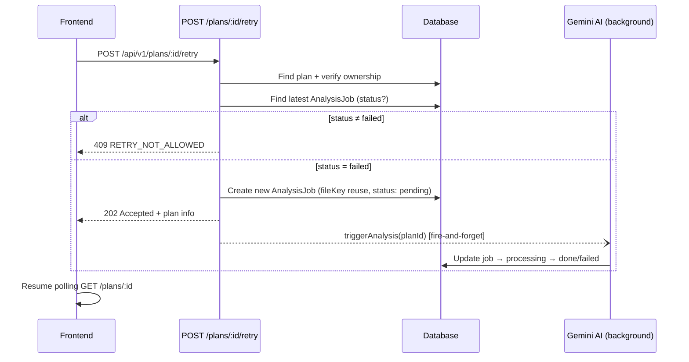

# Issue #106 — API Retry StudyPlan (`POST /plans/:id/retry`)

Khi `AnalysisJob` chuyển sang `failed` (LLM sai format / timeout / hết quota, sau khi `callAiWithRetry` retry hết 3 lần), user hiện phải tạo lại StudyPlan hoàn toàn và **upload lại file** (lên đến 10 MB). File gốc vẫn nằm trên Storage Service qua `AnalysisJob.fileKey` — chỉ cần tạo job mới với cùng `fileKey` rồi trigger lại `processAnalysisJob`.

---

## User Review Required

> [!IMPORTANT]
> **Response Code**: Dùng **202 Accepted** (thay vì 200) vì processing là async — FE sẽ tiếp tục polling `GET /plans/:id` để theo dõi `analysisStatus`. Plan sẵn sàng gợi ý trong issue.

> [!IMPORTANT]
> **Idempotency guard**: Nếu plan đang có AnalysisJob ở trạng thái `pending` hoặc `processing` (user nhấn retry 2 lần liên tiếp), API sẽ trả **409 Conflict** thay vì tạo job mới — tránh chạy song song gây race condition.

> [!WARNING]
> **Xoá concepts/edges cũ**: Khi retry, job sẽ tạo concepts mới cho plan. Cần xem xét: plan ở trạng thái `draft` (failed lần đầu) thì chưa có concepts, nhưng nếu mở rộng cho re-analyze plan `active` sau này, cần xóa concepts cũ trước. Hiện tại scope issue chỉ là plan `draft` với `analysisStatus = failed` → **không cần xoá** vì plan chưa có concepts.
>
> **Lý do an toàn:** Trong `processAnalysisJob`, việc tạo concepts/edges và update plan status nằm trong cùng một `prisma.$transaction`. Nếu job failed → transaction đã rollback → plan vẫn ở `draft` và **chắc chắn chưa có concepts/edges**. Không tồn tại trạng thái trung gian "có concepts nhưng job failed".

## Open Questions

> [!NOTE]
> **Rate limit retry**: Issue gốc không yêu cầu giới hạn số lần retry. Hiện tại tôi sẽ **không** thêm rate limit — mỗi lần retry tạo AnalysisJob mới nên có thể trace/audit được. Nếu cần, có thể bổ sung sau bằng cách đếm số jobs per plan.

---

## Proposed Changes

Tổng cộng **6 file cần sửa/tạo**, tổ chức theo layer:

---

### Service Layer

#### [MODIFY] [plan.service.ts](file:///home/pn0801/Projects/planning-ai/src/server/src/services/plan.service.ts)

Thêm function `retryPlanAnalysis(planId, userId)`:

1. **Fetch plan + latest AnalysisJob** (tương tự `getPlanById` — reuse pattern query `analysisJob.findFirst` với `orderBy: createdAt desc`).
2. **Validate ownership**: Plan phải thuộc user → 403 `FORBIDDEN` nếu không.
3. **Validate trạng thái**: Latest AnalysisJob phải ở `failed` → 409 `RETRY_NOT_ALLOWED` nếu không (cover cả case `pending`/`processing` đang chạy).
4. **Lấy `fileKey`** từ AnalysisJob failed gần nhất.
5. **Tạo AnalysisJob mới** trong DB (single write — **không cần `$transaction`** vì chỉ có 1 create operation, không có side-effect cần rollback):
   ```ts
   await prisma.analysisJob.create({
     data: {
       planDraftId: planId,
       fileKey: existingJob.fileKey,
       status: 'pending',
     },
   });
   ```
6. **Return** plan info (id, name, deadline, status, analysisStatus) để controller trả response.

```diff
+export interface RetryPlanResponse {
+  id: string;
+  name: string;
+  deadline: Date | null;
+  status: StudyPlanStatus;
+  analysisStatus: AnalysisJobStatus;
+}

+export async function retryPlanAnalysis(planId: string, userId: string): Promise<RetryPlanResponse> {
+  // 1. Verify plan exists + ownership
+  // 2. Verify latest job is 'failed'
+  // 3. Create new AnalysisJob with same fileKey
+  // 4. Return plan info with analysisStatus: 'pending'
+}
```

---

### Controller Layer

#### [MODIFY] [plan.controller.ts](file:///home/pn0801/Projects/planning-ai/src/server/src/controllers/plan.controller.ts)

Thêm function `retryPlanController(req, res)`:

1. Validate `req.userId` exists (auth) — throw 401 `UNAUTHORIZED` nếu không.
2. Validate `req.params.id` is present — copy cùng pattern validation từ `getPlanByIdController` (`if (!id || typeof id !== 'string')`).
3. Gọi `retryPlanAnalysis(id, userId)` từ plan.service.
4. Gọi `triggerAnalysis(planId)` fire-and-forget (giống pattern hiện có ở [createPlanController L69](file:///home/pn0801/Projects/planning-ai/src/server/src/controllers/plan.controller.ts#L69)).
5. Log retry event: `console.error` nếu `triggerAnalysis` reject (giống pattern `createPlanController`).
6. Trả **202 Accepted** với plan info.

> [!NOTE]
> **Không cần Zod schema** vì retry là empty POST — không có request body cần validate. Input duy nhất là `req.params.id` (string từ URL).

```diff
+export async function retryPlanController(req: Request, res: Response): Promise<void> {
+  if (!req.userId) throw new AppError('Unauthorized', 401, 'UNAUTHORIZED');
+
+  const { id } = req.params;
+  if (!id || typeof id !== 'string') {
+    throw new AppError('Plan ID is required', 400, 'BAD_REQUEST');
+  }
+
+  const plan = await retryPlanAnalysis(id, req.userId);
+
+  void triggerAnalysis(id).catch((err) =>
+    console.error(`[analysis] retry trigger failed for plan ${id}:`, err)
+  );
+
+  res.status(202).json({
+    success: true,
+    data: { plan, message: 'Analysis retry initiated' },
+  });
+}
```

---

### Route Layer

#### [MODIFY] [plan.routes.ts](file:///home/pn0801/Projects/planning-ai/src/server/src/routes/plan.routes.ts)

Thêm route: `POST /:id/retry` — đặt **trước** `/:id/graph` để tránh conflict.

```diff
 planRouter.get('/:id', asyncHandler(getPlanByIdController));
+planRouter.post('/:id/retry', asyncHandler(retryPlanController));
 planRouter.use('/:id/graph', graphRouter);
```

> [!NOTE]
> Không cần upload middleware vì retry không upload file. Route vẫn nằm dưới `authMiddleware` từ [app.ts L23](file:///home/pn0801/Projects/planning-ai/src/server/src/app.ts#L23).

---

### Type Layer

#### [MODIFY] [plan.types.ts](file:///home/pn0801/Projects/planning-ai/src/server/src/types/plan.types.ts)

Thêm interface `RetryPlanResponse` (bao gồm `deadline` để FE có đủ data hiển thị mà không cần gọi thêm `GET /plans/:id`):

```diff
+export interface RetryPlanResponse {
+  id: string;
+  name: string;
+  deadline: Date | null;
+  status: StudyPlanStatus;
+  analysisStatus: AnalysisJobStatus;
+}
```

---

### Documentation

#### [MODIFY] [plans.md](file:///home/pn0801/Projects/planning-ai/docs/api/plans.md)

Thêm mục **5. Retry Phân tích Study Plan** với đặc tả đầy đủ:

| Aspect                           | Chi tiết                                                                                           |
| -------------------------------- | -------------------------------------------------------------------------------------------------- |
| **Endpoint**                     | `POST /api/v1/plans/:id/retry`                                                                     |
| **Auth**                         | ✅ Bearer Token                                                                                    |
| **Content-Type**                 | Không cần body (empty POST)                                                                        |
| **Success**                      | **202 Accepted** — `{ success: true, data: { plan: {...}, message: "Analysis retry initiated" } }` |
| **Plan không tồn tại**           | 404 `NOT_FOUND`                                                                                    |
| **Không phải owner**             | 403 `FORBIDDEN`                                                                                    |
| **Trạng thái không phải failed** | 409 `RETRY_NOT_ALLOWED` — "Plan analysis is not in a failed state"                                 |
| **Đang có job chạy**             | 409 `RETRY_NOT_ALLOWED` — "An analysis is already in progress"                                     |

---

### Tests

#### [NEW] [retry-plan.test.ts](file:///home/pn0801/Projects/planning-ai/src/server/src/__tests__/retry-plan.test.ts)

Unit test cho `retryPlanAnalysis` service function, mock Prisma:

| #   | Test case                                                                    | Expected                                                                              |
| --- | ---------------------------------------------------------------------------- | ------------------------------------------------------------------------------------- |
| 1   | Plan không tồn tại                                                           | Throw 404 `NOT_FOUND`                                                                 |
| 2   | Plan thuộc user khác                                                         | Throw 403 `FORBIDDEN`                                                                 |
| 3   | Latest job không phải `failed` (đang `processing`)                           | Throw 409 `RETRY_NOT_ALLOWED`                                                         |
| 4   | Latest job không phải `failed` (đang `pending`)                              | Throw 409 `RETRY_NOT_ALLOWED`                                                         |
| 5   | Latest job là `failed` — happy path                                          | Tạo AnalysisJob mới với cùng `fileKey`, trả `analysisStatus: 'pending'`               |
| 6   | Không có AnalysisJob nào                                                     | Throw 409 `RETRY_NOT_ALLOWED`                                                         |
| 7   | Plan có nhiều jobs (1 `done` + 1 `failed`) — retry dựa trên job **mới nhất** | Verify `orderBy: createdAt desc` lấy đúng job failed mới nhất, không phải job done cũ |
| 8   | Verify AnalysisJob mới copy đúng `fileKey` từ job failed                     | Assert `prisma.analysisJob.create` được gọi với `fileKey` giống hệt job failed        |
| 9   | Verify AnalysisJob mới có `status: 'pending'`                                | Assert `prisma.analysisJob.create` được gọi với `status: 'pending'`                   |

---

## Tổng quan flow



---

## File Changes Summary

| File                                                                                                         | Action | Mô tả                              |
| ------------------------------------------------------------------------------------------------------------ | ------ | ---------------------------------- |
| [plan.service.ts](file:///home/pn0801/Projects/planning-ai/src/server/src/services/plan.service.ts)          | MODIFY | Thêm `retryPlanAnalysis()`         |
| [plan.controller.ts](file:///home/pn0801/Projects/planning-ai/src/server/src/controllers/plan.controller.ts) | MODIFY | Thêm `retryPlanController()`       |
| [plan.routes.ts](file:///home/pn0801/Projects/planning-ai/src/server/src/routes/plan.routes.ts)              | MODIFY | Thêm `POST /:id/retry` route       |
| [plan.types.ts](file:///home/pn0801/Projects/planning-ai/src/server/src/types/plan.types.ts)                 | MODIFY | Thêm `RetryPlanResponse` interface |
| [plans.md](file:///home/pn0801/Projects/planning-ai/docs/api/plans.md)                                       | MODIFY | Thêm mục 5 — Retry API spec        |
| [retry-plan.test.ts](file:///home/pn0801/Projects/planning-ai/src/server/src/__tests__/retry-plan.test.ts)   | NEW    | Unit tests cho retry logic         |

> [!NOTE]
> **Không cần thay đổi**: Prisma schema (không thêm field/model mới), `analysis.service.ts` (reuse `triggerAnalysis` + `processAnalysisJob` nguyên bản), `storage.service.ts`, `upload.middleware.ts`.

> [!NOTE]
> **Tại sao `triggerAnalysis` hoạt động mà không cần sửa:** Hàm `triggerAnalysis(planId)` trong [analysis.service.ts L146-L153](file:///home/pn0801/Projects/planning-ai/src/server/src/services/analysis.service.ts#L146-L153) tìm AnalysisJob có `status: 'pending'` mới nhất (`orderBy: createdAt desc`). Khi retry tạo job mới với `status: 'pending'`, hàm sẽ tự động pick đúng job này. Không có logic nào cần thay đổi.

---

## Verification Plan

### Automated Tests

```bash
cd src/server && npx jest --testPathPattern=retry-plan --verbose
```

### Manual Verification

1. Tạo plan với file → chờ analysis hoàn tất hoặc fail.
2. Nếu cần force fail: set `USE_MOCK_AI=false` và chặn Gemini API key.
3. Gọi `POST /api/v1/plans/:id/retry` → verify 202 response.
4. Poll `GET /api/v1/plans/:id` → verify `analysisStatus` chuyển từ `pending` → `processing` → `done`.
5. Test error cases: retry plan đang active, retry plan của user khác, retry khi đang processing.

### Build Check

```bash
cd src/server && npx tsc --noEmit
```
